# Realtime Analytics 

### Project Outline 
The purpose of realtime analytics is to **simulate strategies**(backtesting) and test strategies in **realtime**(realtime testing). Databases will be created using **MySQL** and **Mongo DB**, reading and writing to multiple DBs will be exercised by the script. Various APIs and webscrappers will be used to collect data to be saved into **MySQL** data bases. The script will generate various mathmatical plots using **pandas, matplotlib** and **plotly** packages to show trends and illustrate relationships between data. The outputs of data will be organised into web frame structures to be presented. Within the webpages the program will have plots, tables, ranking systems and text to describe the outputs. **Django** will be used as the main web frame work. **Django** will contain login access to only show the webpage results to authorized users. The webpages will contain various sub-pages within it. In the instances of presenting the strategy outputs the code will utilize Sphinx a python documentation generator. **Sphinx** will be linked to **Django** to have the generated documents accessible within **Django**. The startegies presented on **Sphinx** will be auto generated in realtime whilts the **Code and Project Documents** are already pre-configured **Sphinx** documents.

### Strategies
To see the profitability of trading strategies they are tested for by doing simulations and in realtime. Not all strategies are tested for in realtime but all are tested through backtesting simulations. The strategies with exceptional outputs are then validated by testing in realtime. The strategies could be functioning on one or more perpetuals **(Inverse, Inverse Futures, USDT ... )**. The trade direction of the of the strategies are based on the three trading modes **(long, short, long and short)**. PnL outputs of strategies are dependant on the direction of trades since a strategy could be performing well on a single direction and poorly on the other **(Long, Short Modes)** or could be performing well in both **(Long and Short Mode)**. Another dependency when it comes to PnL outputs is the interest rate **(Compounding, NonCompounding)**. The interest indicates the amount of position size that should be utilised for upcoming trades. A strategy could adjusts its position size realtive to capital **(Compounding)** or have it at a fixed amount **(Non Compounding)**. Various Analytical tools are used to see the stats of the strategy. Some of elements to look for in strategies are the expected returns, risk, predictability and so on. Based on these analytical tools a ranking system could be configured to filter and use the best of the strategies. 

### What this Section is about ...
This documentation shows the outline of creating a **Django** webframe and embedding **Sphinx** within it. Both **Sphinx** and **Django** will utilise **MySQL** database to read data from. The bullet points below expand upon all the parts of the website which include the **Login page, Main page, Strategy Overview page** and the **Sphinx document**. 
* **Login Page:** To access the contents of the website the user will have to login with their set user name and password. If the user has <span style="color:red">5</span> failed attempts they will be timed out for 30 minutes. Once the timeout period is over the user will be able to log back in once again. Once successfully loged in the user will be on the **Main page**. 

* **Main Page:** The **Main page** contains all the categories of trading strategies. These categories could vary from asset classes like **forex, crypo, stocks** or it could be split by strategies **momentum based, sentiment based etc**, the backend developers create these categories to be accessed.The user will have the ability to log out from the main page or they could continue by clicking into one of the categories which leads us into the next section of the website. 

* **Strategy Overview:** Once the user accesses one of these categories they will be greated with the **Strategy Overview page**. This page contains the overview of all the configurations of a particular strategy. A configuration of a strategy is the a fixed or relative parameters of a strategy, these parameters could be altered to achieve optimisation. For example an **RSI** strategy has the parameters of the last **nth number of candles, upper limit and lower limit**. So we can place vbalues for these parameters and we could test for **(450, 45, 55)** and **(600, 45, 60)** being **(# of candles, upper limit, lower limit)**. **(450, 45, 55)** and **(600, 45, 60)** are just two particular examples you could have many cases, hundreds of thousands even to find the most efficient strategy. The **Strategy Overview page** shows the summary of all the configurations that are tested for. So the user will be able to see a bunch of  plots and sheets comparing all the configurations to one another. The tables could be filtered out by columns of ascending and descending order etc. Some plots will also be interactive. On each sheet there will be the **Configurations** column, where once clicked it will lead the user into the **Sphinx document**. The drop down menu located at the top far right will allow the user to go back to the **Main Page** or  **Log-out**. 

* **Sphinx Document:** To access more indepth information about a strategy the user will have to access the **Sphinx** document. The **Sphinx** document will be seperated into different pages that is accessible by the **Table of Contents** located at the top left part of the website. The pages will be categotised into sections such as **PnL and Capital, Timing, Risk, etc..**. The Sphinx documents values will be calculated in realtime as soon as the user requests to access a certain strategy. Once the values are calculated they will be presented in the form of a document as a website. 

There will be more detailed information relating to each part later on in the section. 

#### Wireframe Diagram 
<p align="center">
  
</p>

### Sources

#### Documentation 

<a href="https://www.sphinx-doc.org/en/master/contents.html" target="_blank">Sphinx</a>

<a href="https://docs.docker.com/language/python/build-images/" target="_blank">Build Python Image on Docker </a>

<a href="https://django-sphinxdoc.readthedocs.io/en/latest/" target="_blank">Add Sphinx within Django</a>

#### Functionality 

<a href="https://sphinx-gallery.github.io/dev/auto_examples/plot_9_plotly.html" target="_blank">Using Plotly with Sphinx</a>

<a href="https://skonik.me/setup-django-with-mysql-using/" target="_blank">Setup Django with MySQL using Docker</a>

<a href="https://www.javatpoint.com/how-to-connect-mysql-to-django" target="_blank">Connect MySQL to Django</a>

<a href="https://medium.com/@vvvlad42/create-great-documentation-with-sphinx-and-markdown-175c4017ae5a#:~:text=Sphinx%20is%20natively%20using%20reStructuredText,one%20google%20search%20away%E2%80%A6" target="_blank">Use Markdown with Sphinx</a>

<a href="https://realpython.com/django-hosting-on-heroku/" target="_blank">Hosting a Django Project on Heroku</a>

<a href="https://hevodata.com/learn/docker-mysql/" target="_blank">Docker MySQL Container</a>

### Table of Contents

* [Flow Chart](#flow-chart)
* [Directory Tree](#directory-tree)
* [Code Structure](#code-structure)
    * [Outline](#outline)
    * [CCXT](#ccxt)
    * [PnL Values](#pnl-values)
    * [Plotting](#plotting)
    * [Main Script](#main-script)
* [Heading 3](#link)
  * [Sub Heading 3 A](#link)
  * [Sub Heading 3 B](#link)

### Flow Chart

<details>
<summary>View the Flowchart </summary>
<p align="center">
  
</p>
</details>

<head>
  <script src="https://cdn.jsdelivr.net/npm/d3@7"></script>
  <script src="https://cdn.jsdelivr.net/npm/topojson-client@3"></script>
  <script src="https://cdn.jsdelivr.net/npm/vega@5/build/vega-core.min.js"></script>
</head>

### Directory Tree 

```
Project Folder/
├─Configurations/
│ ├─APIs/
│ │ └─CCXT.py
│ └─Matplotlib_Pandas.py
├─Log Info/
│ └─Post-testing-analysis.log
├─PnL_vals.py
└─Realtime_analytics.py
```

### Code Structure 

#### Outline
The code will be organized and divided into 4 sections, using 4 scripts (`Realtime_analytics.py`, `PnL_vals.py`, `CCXT.py`, `Matplotlib_Pandas.py`). The code structure is split based on categories. The `Realtime_analytics` is the main script. The diagram below shows the **Utilities** of each script:

<p align="center">
  
</p>

Here is a table describing the general purpose of each script:

|Script|Purpose and Description|
|---|---|
|`Realtime_analytics.py`|Is the main file for **Realtime Analytics**. Controls the flow of code.Records runtime errors to `Post-testing-analysis.log`. Saves the diagram outputs as a PDF.|
|`CCXT.py`|Foregathers data by establishing a connecttion with the `CCXT` API. Collects data for _**Historical Trades**_ and _**Funding Rate History**_. |
|`PnL_vals.py`|Contains a variety of mathmatical functions designated for financial analytics. Calculates the _**PNL %**_ and the _**Capital Increment**_ values.  |
|`Matplotlib_Pandas.py`|Used for plotting and manipulations of data frames. Different variations of _**Line**_ and _**Bar plots**_ are produced.|

<br>
<details>
<summary>Here is another visualisation of the scripts with their utilities shown with leves :</summary>
<p align="center">
  
</p>
</details>
</br>


## **Docker**

Resources:
* [Build your Python image](https://docs.docker.com/language/python/build-images/)
* [Cython in Docker Container](https://gist.github.com/dariodip/4e0133eaa8733e4206ccdb48e7af6a90)
* [List of Docker Blogs](https://takacsmark.com/)

Docker creates containerization. Containerization application runs in an isolated container, that is an explicitly defined, reproducable and portable environment. Docker is very usefull for environment setup and management for projects. The [About](#about-docker) section goes over the details on how to use Docker feautures and the [Project Objective](#project-objective-docker) goes over how the project uses Docker feuatures. 

### **About Docker**
Resources:
* [Docker Hub](https://hub.docker.com/search?q=&type=image)
* [Docker Engine](https://docs.docker.com/engine/install/)
* [Attached vs Detached Mode Containers](https://www.java4coding.com/contents/docker/docker-attached-vs-detached-mode#:~:text=Detached%20mode%2C%20started%20by%20the,session%20without%20stopping%20the%20container.)

#### **Containers**
A container of an app is the app’s operating environment in our computing scenario. With Docker, you ship the operating environment along with your application. By using the command `docker run` a preconfigured image will start to run. So essentially a container is a running instance of an image.

Images may come from two sources:

* **Image repository** being the [Docker Hub](https://hub.docker.com/search?q=&type=image).

* **Creating individual images**, Docker images are layered. Building images layer by layer, and constructing images starting from other images.

In order to use Docker on your local machine or server [Docker Engine](https://docs.docker.com/engine/install/) is required. When the Engine is installed `docker --version` and `docker-compose --version` should work. Show the version information of two essential Docker tools. 

#### **Running Containers**
From [Docker Hub](https://hub.docker.com/search?q=&type=image) you can look at available images. These images will have corresponding versions associated with them. In order to use the image we can execute two steps:

* Pull the image with `docker pull`. Docker pull will just download the image locally, and you’ll see it in your image list.
* You can run the image with `docker run`, this will pull the image, if it’s not available locally and then run it. Run is just a one-step solution to pull and run.

For available image options to be pulled you can check the **tags** tab of an image in [Docker Hub](https://hub.docker.com/search?q=&type=image). For example here are all the image tags for [nginx](https://hub.docker.com/_/nginx?tab=tags).

`docker run` is the command that starts up containers from images. If it cannot find the image locally it will pull it for you. For more formats you can use the `--name` to give a docker container a readable name and n order to make a certain application available on your local machine, we have to map its port to the local machine’s port. This is done with `-p host-port:container-port`, in our case `-p 80:80`.

**Docker run example with `--name` and `-p <number>:<number>`**
```cmd
docker run --name my-nginx -p 80:80 nginx:1.10.1-alpine
```
runs the nginx container on alpine (unix distribution) with version 1.10.1. Containers name is my-nginx and exposes port 80. 

If we add `-d` start the container in detached mode, so it will run in the background. In detached mode it does not receive input or display output in the terminal. Using detached mode also allows you to close the opened terminal session without stopping the container. 
```cmd
docker run --name my-nginx -d -p 80:80 nginx:1.10.1-alpine
```
Same example but the container is running in the background.

#### **Working with Containers**
The machine that runs Docker engine is the **host machine**.Your ultimate goal is to compose the services of your host with one or more Docker containers. Containers behave like standalone virtual machines. They have their own Linux file system, users, hardware resources, environment variables, executables and so on. Containers expose their services on pre-defined ports.

If you want to change the runtime parameters of a container, you’ll have to stop the container and remove it. Then you need to create a new container from the image with new runtime parameters. For example, I could `start`, `stop` and `restart` containers, but altering runtime parameters like chain the name or the changing between detached and attached mode will require the makings of a new container.  

#### **Executing Commands in running Containers**
Resources
* [Docker exec command](https://docs.docker.com/engine/reference/commandline/exec/)

Executing commands with the `docker exec` is used for executing commands whilst a container is running for more information check the [Docker exec command](https://docs.docker.com/engine/reference/commandline/exec/) page. You can also use Linux interactive shell if the container running has a Unix image like `docker exec -ti <container name> /bin/sh` could open the interactive shell in an alpine container. 

#### **Data with Containers**
Resources:
* [Docker Volumes](https://earthly.dev/blog/docker-volumes/)

Containers are meant to be stateless. This means that they are reproduced exactly as they were defined, and they don’t carry any information with them from any runtime. If you change some data in a container during runtime, like data in a mariadb container for example, that data will be available only in that specific container instance. If you stop and restart your container your data will still be there. But if you stop and remove your container to start it with new parameters your data will be lost.

In order to manage data and code changes in a meaningful way, we can share volumes (meaning data volumes) between the host and the container. Using volumes I can keep my database data outside the container, or I can serve my local development directory with a Docker container.

#### **Docker Files** 
Resources:
* [Docker File Reference](https://docs.docker.com/engine/reference/builder/)
* [Docker File Blog](https://takacsmark.com/dockerfile-tutorial-by-example-dockerfile-best-practices-2018/#overview)

A Dockerfile is a text file that defines a Docker image. Essentially a Docker file creates custom environment to be used in a Docker container. Every build step in your Dockerfile will create a new layer in your image. If there is a change in a layer, the image will only rebuild starting from that layer and building every consecutive layer. The layers below the changed layer will remain intact. This is called **layer caching**.

Each line in the Docker file creates an instruction and is used for layer building. 

**Example of the Contents of a Dockerfile**
```dockerfile
FROM nginx:1.10.1-alpine
MAINTAINER me@example.com
COPY ./nginx.conf  /etc/nginx/nginx.conf
```
**Docker File Instructions and Meannings**

|Instruction|Meannings|
|---|---|
|`FROM`|Specifying which image we derive our image from.|
|`MAINTAINER`|Instruction for specifiying the maintainers of the image. Place the email address in this instrucion.|
|`COPY`|Copiying the local file into the image.|
|``||

#### **Docker Compose**
Resource
* [Docker Compose Reference](https://docs.docker.com/compose/)
* [Docker Compose Blog](https://takacsmark.com/docker-compose-tutorial-beginners-by-example-basics/)

The Docker feauture docker-compose to define and run multi container applications. Just like the Docker file it is a file but in the `.yml` format. 

#### **Docker Commands and Meannings**
|Commands|Meannings|
|---|---|
|`docker --version`| Shows the docker version.|
|`docker-compose --version`|Shows the docker compose version.|
|`docker run <container name>`|Starts the selected docker container.|
|`docker images`|Shows all the setup Docker images.|
|`docker pull <image:version>`|Downloads image locally. You can view the pulled image in the image list.|
|`docker ps`|Shows a list of running containers.|
|`docker ps -a`|Shows a list of all containers, running and stopped.|
|`docker stop <container name>`|Stops Container.|
|`docker start <container name>`|Starts Container.|
|`docker restart <container name>`|Restart Container.|
|`docker rm <container name>`|Removes container.|
|`docker logs <container name>`|Shows the logs of a container.|
|`docker logs -f <container name>`|Leave logs open in terminal and follow the requests.|
|`docker inspect <container name>`|Shows the details of the container.|
|`docker exec -ti <container name> /bin/sh`|Starts an interactive shell in our running container. Goves root access and root access and avalability to Linux file system.|
|`docker exec`|For executing a command in a running container.|

#### **Docker File**
Resources:
* [Tutorial YT video on Docker File](https://www.youtube.com/watch?v=pTFZFxd4hOI&t=1486s&ab_channel=ProgrammingwithMosh)

* [Docker File Tutorial Article](https://takacsmark.com/dockerfile-tutorial-by-example-dockerfile-best-practices-2018/)

Docker file is designated to create a docker image to be used. This docker image will contain an os, code, python packages, python with specified version. The docker file will be necessary for when deploying the program into new nodes. Create a docker file with the following properties.

* Install **Python** version 3.9. 
* Create a **WORKDIR** called `/app`. 
* **COPY** `requirements.txt` into the **WORKDIR** directory. 
* run pip3 install to install all the python packages from `requirements.txt`. 
* Place the **COPY . .** to copy all the code scripts into the **WORKDIR** (`\app`).


#### Docker Compose File 
Resources:

* [Tutorial YT video on Docker Compose](https://www.youtube.com/watch?v=HG6yIjZapSA&ab_channel=ProgrammingwithMosh)

* [Get started with Docker Compose](https://docs.docker.com/compose/gettingstarted/)

* [Docker Compose File all you need to Know](https://takacsmark.com/docker-compose-tutorial-beginners-by-example-basics/)

* Setup Django 
    * Connect Mongo DB to Django 
    * Connect to MySQL
    * Connect to port 
* Run the Django Server
* Create volume for mysql-data and Mongo DB


#### Manually Creating a MySQL Data Base in Docker 
* For Docker to run persistant data and configuration it has to create volumes run `docker volume create mysql` and `docker volume create mysql_config`.
* Run the command `docker network create mysqlnet` to create a network. Docker pulls the iamge from the hub and run it locally. 
* Run `docker run --rm -d -v mysql:/var/lib/mysql \` to see the configurations of the mysql network.
* To make sure the DB is running run ` docker run --rm -d -v mysql:/var/lib/mysql \` and enter the password.


#### Building the Image 

* Build the image by executing the command `docker build --t varyon-trading-app:v1.0.0`, gives the tag `v1.0.0` to the image. 
* View all images by executing the command `docker images`. The newly created image should appear in this field. 
* Run the docker image with the command `docker run varyon-trading-app`.
* The command to see all working images in docker is `docker ps`. To see all containers we can run `docker ps -a` weither the container is running or not seen in the `STATUS` column. 
* To stop a docker image from running you can use the commannd `docker stop varyon-trading-app`.
* To restart a container execute `docker restart varyon-trading-app`.
* To remove a container execute `docker rmi varyon-trading-app`.


### Project Objective: Docker

## Poetry 

Resources:
* [Dependency Management With Python Poetry](https://realpython.com/dependency-management-python-poetry/#work-with-python-poetry)
* [Poetry Documentation](https://python-poetry.org/docs/)

Poetry manages external dependencies of python projects. After an update, a package might not work as it did before the update. Poetry can specify, install, and resolve external packages in your projects. Ensuring the correct dependency versions are running on each machine. The [About Poetry](#about-poetry) section talks about the usefull feautures of poetry whist the [Project Objective: Poetry](#project-objective-poetry) outlines how the project utilizes Poetry. 

### **About Poetry** 
The recommended way to install Poetry is by using the official install-poetry script. You can either download and run this Python file manually or select your operating system below to use the appropriate command:

#### **Installation and Setup**
Windows Powershell:
```powershell
PS C:\> (Invoke-WebRequest -Uri https://raw.githubusercontent.com/python-poetry/poetry/master/install-poetry.py -UseBasicParsing).Content | python -
```
Mac + Linux Shell 
```console
$ curl https://raw.githubusercontent.com/python-poetry/poetry/master/install-poetry.py | python3 -
```

After installation you can create a poetry project by using the `poetry new <project name>` command. which would create the following porject structure below. 

Project Structure 
```
project-folder/
│
├── project_folder/
│   └── __init__.py
│
├── tests/
│   ├── __init__.py
│   └── test_rp_poetry.py
│
├── README.rst
└── pyproject.toml
```

The `__init__.py` are used to mark directories on disk as Python package directories. If you remove the `__init__.py` file, Python will no longer look for submodules inside that directory, so attempts to import the module will fail. Check the [Stack Overflow Post](https://stackoverflow.com/questions/448271/what-is-init-py-for) for a more detailed explanation. 

Poetry adds the first test to the project. The `test_version()` function checks whether the `__version__` variable of `project-folder/__init__.py` contains the expected version.

#### **pyproject.toml File**

Resources :
* [Use the pyproject.toml file](https://realpython.com/dependency-management-python-poetry/#use-the-pyprojecttoml-file)
* [pyproject.toml Source Trees](https://peps.python.org/pep-0517/#source-trees)

The `pyproject.toml` file is a configuration file standard that was defined in PEP 518. This PEP specifies how Python software packages should specify what build dependencies they have in order to execute their chosen build system. `pyproject.toml` file is written in TOML format which is flexible enough, with better readability and less complexity than the other options, which are YAML, JSON, CFG, or INI.

**Example TOML file**
```toml
# pyproject.toml

[tool.poetry]
name = "rp-poetry"
version = "0.1.0"
description = ""
authors = ["Philipp <philipp@realpython.com>"]

[tool.poetry.dependencies]
python = "^3.9"

[tool.poetry.dev-dependencies]
pytest = "^5.2"

[build-system]
requires = ["poetry-core>=1.0.0"]
build-backend = "poetry.core.masonry.api"
```
The `pyproject.toml` is split into sections are called tables. These sections are denoted by `[table.name]`. They contain instructions that tools like Poetry recognize and use for dependency management or build routines. In the example above there are four tables.

**tool.poetry and build-system**

If a table name is tool-specific, it must be prefixed with `tool`. By using such a subtable, you can add instructions for different tools in your project. In the example above there is only `tool.poetry`. There are optional and non optional keys under `[tool.poetry]`.General information about your Poetry project is stored here. Your available keys are defined by Poetry. While some keys are optional, there are four that you must specify:
1. name: the name of your package
2. version: the version of your package, ideally following semantic versioning
3. description: a short description of your package
4. authors: a list of authors, in the format name <email>

`[build-system]` defines data that Poetry and other build tools can work with, but as it’s not tool-specific, it doesn’t have a prefix. Poetry created the pyproject.toml file with two keys in place:

1. requires: a list of dependencies that are required to build the package, making this key mandatory
2. build-backend: the Python object used to perform the build process

to learn more about pyproject check out [pyproject.toml Source Trees](https://peps.python.org/pep-0517/#source-trees). 

#### **Virtual Environments**

Resources:
* [Managing Environments](https://python-poetry.org/docs/managing-environments/)

Poetry does not create a virtual environment when a new project is created. A virtual environments job is to isolate the dependencies of a project in a confined directory so it does not interfere with other projects. 

Create a virtual environment explicity definning the python version after going into the the folder directory
```cmd
poetry env use python3.7
```
Example output of env creation: 
```cmd
Creating virtualenv realpoetry-c_dX75o_-py3.7 in C:\Users\Edge\AppData\Local\pypoetry\Cache\virtualenvs
Using virtualenv: C:\Users\Edge\AppData\Local\pypoetry\Cache\virtualenvs\realpoetry-c_dX75o_-py3.7
```
To view the list of created virtual environments and if they are activated:
```cmd
poetry env list 
```
Example output of env list:
```cmd
test-O3eWbxRl-py2.7
test-O3eWbxRl-py3.6
realpoetry-c_dX75o_-py3.7 (Activated)
```
 For more information look at [Managing Environments](https://python-poetry.org/docs/managing-environments/) 

As long as you’re inside your project folder, Poetry will use the virtual environment associated with it. 

#### **Declaring Dependencies**

Resources:
* [What is the difference between deps and dev-deps in Poetry?](https://stackoverflow.com/questions/57645942/what-is-the-difference-between-deps-and-dev-deps-in-poetry)
* [Declare Your Dependencies](https://realpython.com/dependency-management-python-poetry/#declare-your-dependencies)

In the `pyproject.toml` configuration file of Poetry you can specify both `dependencies` and `dev-dependencies`. all the requirements of the project will go into `dependencies` as the project cannot work without it. As for the `dev-dependencies` which will not be present in the release build. The best use case for dev-dependencies is when you creating a library with optional dependencies.

**Example of Dependencies and Dev-Dependencies**
```toml
[tool.poetry.dependencies]
python = "^3.9"

[tool.poetry.dev-dependencies]
pytest = "^5.2"
```
In the example above only `Python version 3.9` is a requirement whilst `pytest` is not.

The `Poetry install` command Poetry checks your `pyproject.toml` file for dependencies then resolves and installs them. The resolving part is especially important when you have many dependencies that require different third-party packages with different versions of their own. Before installing any packages, Poetry figures out which version of a package fulfills the version constraints that other packages set as their requirements. Creates a `poetry.lock` file at the end. 

**Versioning Constraints**

Dependencies for a project can be specified in various forms, which depend on the type of the dependency and on the optional constraints that might be needed for it to be installed. A more in depth list of [version constraints](https://python-poetry.org/docs/dependency-specification/#version-constraints) can be followed in the hyperlink.

**Common Contsraints and Meannings**

|Contsraints|Meanning|
|---|---|
|[Caret(^)](https://python-poetry.org/docs/dependency-specification/#caret-requirements)|An update is allowed if the new version number does not modify the left-most non-zero digit in the major, minor, patch grouping.|
|[Tilde(~)](https://python-poetry.org/docs/dependency-specification/#tilde-requirements)|Specify a minimal version with some ability to update. If you specify a major, minor, and patch version or only a major and minor version, only patch-level changes are allowed.|
|[Wildcard(*)](https://python-poetry.org/docs/dependency-specification/#wildcard-requirements)| Allow for the latest (dependency dependent) version where the wildcard is positioned.|
|[Inequality(<,>,>=,!=)](https://python-poetry.org/docs/dependency-specification/#inequality-requirements)|Allow manually specifying a version range or an exact version to depend on.|
|[Exact Requirements](https://python-poetry.org/docs/dependency-specification/#exact-requirements)|You can specify the exact version of a package. This will tell Poetry to install this version and this version only.|
|[Multiple Requirements](https://python-poetry.org/docs/dependency-specification/#multiple-requirements)|Multiple version requirements can also be separated with a comma, e.g. `>= 1.2, < 1.5`.|
|[Git Dependencies](https://python-poetry.org/docs/dependency-specification/#git-dependencies)|To depend on a library located in a git repository, the minimum information you need to specify is the location of the repository with the git key.|
|[Path Dependencies](https://python-poetry.org/docs/dependency-specification/#path-dependencies)|To depend on a library located in a local directory or file, you can use the path property|
|[URL Dependencies](https://python-poetry.org/docs/dependency-specification/#url-dependencies)|To depend on a library located on a remote archive, you can use the url property.|
|[Python Restricted Dependencies](https://python-poetry.org/docs/dependency-specification/#python-restricted-dependencies)|You can also specify that a dependency should be installed only for specific Python versions.|
|[Using Environment Markers](https://python-poetry.org/docs/dependency-specification/#using-environment-markers)|If you need more complex install conditions for your dependencies, Poetry supports environment markers via the markers property.|
|[Dependencies Specification](https://python-poetry.org/docs/dependency-specification/#multiple-constraints-dependencies)|Sometimes, one of your dependency may have different version ranges depending on the target Python versions|
|[Expanded Dependency Specification Sytntax](https://python-poetry.org/docs/dependency-specification/#expanded-dependency-specification-syntax)|In the case of more complex dependency specifications, you may find that you end up with lines which are very long and difficult to read. In these cases, you can shift from using “inline table” syntax, to the “standard table” syntax.|

#### **Installing Packages**

By running `poetry add <package name>`, you’re adding the latest version of the package to your project. You can use version constraints like <package name> <=2.1 or <package name> ==2.24 if you want to be more specific. When you don’t add any constraints, Poetry will always try to install the latest version of the package.

To run packages as a development dependency, you run poetry add with the `--dev` option. You can also use a shorthand `-D` option, which is the same as `--dev`. So making the sytax of the command `poetry add <package name> -D`. 

#### **Poetry Lock**

In the `poetry.lock` file, Poetry keeps track of all packages and the exact versions you’re using in the project.

As long as there’s no `poetry.lock file` present in your project, you can run `poetry install` after manually adding dependencies, because Poetry looks for a `poetry.lock` file first. If it doesn’t find one, Poetry resolves the dependencies listed in the `pyproject.toml` file.

As soon as a `poetry.lock` file is present, Poetry will rely on this file to install dependencies. Running only `poetry install` would trigger a warning that both files are out of sync and would produce an error because Poetry wouldn’t know of any newly installed package versions in the project yet.

To pin manually added dependencies from your `pyproject.toml` file to `poetry.lock`, you must first run the `poetry lock` command.

By running `poetry lock`, Poetry processes all dependencies in your `pyproject.toml` file and locks them into the `poetry.lock` file. It also recursively traverses and locks all dependencies of your direct dependencies.

Once the new package is locked it still cannot be imported as you have not downloaded it yet. After locking dependencies with the `poetry lock` command, you have to run the `poetry install` command so that you can actually use them in your project. 


#### **Updating Dependencies**

Updating your dependencies, Poetry provides different options depending on two scenarios:

1. Update a dependency inside your version constraints.
2. Update a dependency outside your version constraints.

The update command will update all your packages and their dependencies within their version constraints. Afterward, Poetry will update your `poetry.lock` file.

If you want to update a dependency with a version that’s higher than the defined version in the pyproject.toml file, you need to adjust the pyproject.toml file beforehand. Another option is to run the add command with a version constraint or the latest tag:
```cmd
poetry add <package name>@latest --dev
```
After adding a new version, you must run the `install`. Only then are your updates locked into the `poetry.lock` file.

If you’re not sure which version-based changes an update would introduce to your dependencies, you can use the `--dry-run` flag. This flag works for both the update and the add commands. It displays the operations in your terminal without executing any of them. This way, you can spot version changes safely and decide which update scenario works best for you.
```cmd
poetry update --dry-run
```
#### **Adding Poetry to New Projects**

To add Poetry to new projects the command `poetry init` could be used. `poetry init` command will start an interactive session to create a `pyproject.toml` file. Poetry gives you recommendations for most of the configurations you need to set up.

For projects that already have a `requirements.txt` file. You can use `cat requirements.txt` to read the `.txt` file and use `poetry add "cat requirements.txt"` to add all the depencies stated in the .txt file. To export the `requirements.txt` file use the command `poetry export --output requirements.txt`, which will create a `requirements.txt` file from the already existing dependencies from the `poetry.lock` file. 

#### **Poetry Command Table**

To see a much more simplified version of Poetry Commands click the hyperlink: [Command References](https://realpython.com/dependency-management-python-poetry/#command-reference).

|Command|Description|
|---|---|
|`poetry new <project-name>`|Creates a new project structure that contains  `pyproject.toml`, `README.rst`, `tests` and `<project name>` folder.|
|`poetry new <folder name> --name <package name>`|The `--name` option to name the package name differently than the project folder.|
|`poetry new --src <project-name>`| store your source code in an additional src/ parent folder with the `--src`|
|`poetry env use python3`|Creating the poetry virtual environment|
|`poetry config --list`|To see the current configuration, including the configured cache-dir.|
|`poetry env list `|To see all the created virtual environments and if they are activated or not.|
|`poetry install`|install command, Poetry checks your pyproject.toml file for dependencies then resolves and installs them|
|`poetry add <package name>`|Installing `dependency` packages. The newly added packages could be seen on `pyproject.toml` and `poetry.lock`.|
|`poetry add <package name> -D`|Installing `dev-dependency` packages. The newly added packages could be seen on `pyproject.toml` and `poetry.lock`.|
|`poetry lock`| Locking manually added `dependencies` tp `pyproject.toml`.|
|`poetry lock --no-update`|Stops the updates of any deependencies in the `poetry.lock` file by adding the `--no update` option.|
|`poetry run python3`|Opens the Python Interpreter.|
|`poetry show --help`|For inspecting a package, you can use show with the package name as an argument. Disregards the constraints and updates the dependencies.|
|`poetry update`|Updates the `dependencies` in the `pyproject.toml` file.|
|`poetry update <package name 1> <package name 2>`|Updates the selected packages in the  `pyproject.toml` file.|
|`poetry add <package name>@latest --dev`|Updates the dependencies of the project to the latest version. |
|`poetry update --dry--run`|`flag` works for both the `update` and the `add` commands. It displays the operations in your terminal without executing any of them. This way, you can spot version changes safely and decide which `update`scenario works best for you.|
|`poetry init`|Adds poetry to a already existing python project.|
|`poetry add "cat requirements.txt"`|Reads the `requirements.txt` file using the `cat` command and then adds it using the `add` command. Used for utilising `requirements.txt` dependencies to poetry.|
|`poetry check`|checks the structure of the `pyproject.toml`. Lets the user know if it is valid.|
|`poetry export --output requirements.txt`|Using the poetry export command in this way creates a requirements.txt file that includes hashes and environment markers. Adding `--dev` to the command will also add for the development dependencies.|
|`poetry run python3 <python file>`|poetry runs the selected python file.|

### Project Objective: Poetry

## Pytest

Resources:
* [Pytest Documentation](https://docs.pytest.org/en/7.1.x/index.html)
* [Effective Python Testing With Pytest](https://realpython.com/pytest-python-testing/#:~:text=pytest%20enables%20you%20to%20create,in%20a%20large%20test%20suite.)

The Pytest is a more enriched version of the built in unit testing module for python. Pytest module is made to maintain test and to ensures that changes to your code won’t cause regressions. pytest offers a core set of productivity features to filter and optimize your tests along with a flexible plugin system that extends its value even further. The [About Pytest](#about-pytest) goes into detail bout the basic feautures of Pytest, this part could be skipped. Look at the [Project Objective: Pytest](#project-objective-pytest) for project details.

### About Pytest 
Pytest uses the Arrange-Act-Assert model:

1. Arrange, or set up, the conditions for the test
2. Act by calling some function or method
3. Assert that some end condition is true

Along with using assert some of the usefull components of pytest are:

* [Fixtures](#fixtures) for handling test dependencies, state, and reusable functionality
* [Marks](#marks) for categorizing tests and limiting access to external resources
* [Parametrization](#parametrization) for reducing duplicated code between tests
* [Durations](#durations) to identify your slowest tests
* [Plugins](#plugins) for integrating with other frameworks and testing tools

#### Fixtures
Resources
* [Pytest Documentation Fixtures](https://docs.pytest.org/en/6.2.x/fixture.html#what-fixtures-are)
* [Fixtures Managing State and Dependencies](https://realpython.com/pytest-python-testing/#fixtures-managing-state-and-dependencies)

Fixtures can be used when several tests that all make use of the same underlying test data. To learn more about fixtures read the documentation [What Fixtures Are](https://docs.pytest.org/en/6.2.x/fixture.html#what-fixtures-are). 

When pytest goes to run a test, it looks at the parameters in that test function’s signature, and then searches for fixtures that have the same names as those parameters. Once pytest finds them, it runs those fixtures, captures what they returned (if anything), and passes those objects into the test function as arguments.

```python
import pytest

@pytest.fixture
def fruit_bowl():
    return 'apple'


def test_fruit_salad(fruit_bowl):
    # Assert
    assert 'apple' in fruit_bowl 
```
Same as 

```python 
def fruit_bowl():
    return 'apple'


def test_fruit_salad(fruit_bowl):
    # Assert
    assert 'apple' in fruit_bowl 

bowl = fruit_bowl()
test_fruit_salad(fruit_bowl=bowl)
```

#### Marks 

Resources:
* [Marks: Categorizing Tests](https://realpython.com/pytest-python-testing/#marks-categorizing-tests)
* [How to mark test functions with attributes](https://docs.pytest.org/en/7.1.x/how-to/mark.html#:~:text=By%20using%20the%20pytest.,the%20CLI%20%2D%20pytest%20%2D%2Dmarkers%20.)
* [Working with custom markers](https://docs.pytest.org/en/7.1.x/example/markers.html#working-with-custom-markers)

In large test scenarios it might be usefull to creates marking in `pytest`. Marking has a filtering functionality. Running marked test conditions could be ran through the CLI. A mark could be set by `@pytest.mark.___`. 

Here are some of the builtin markers:

1. [usefixtures](https://docs.pytest.org/en/7.1.x/how-to/fixtures.html#usefixtures) - use fixtures on a test function or class

2. [filterwarnings](https://docs.pytest.org/en/7.1.x/how-to/capture-warnings.html#filterwarnings) - filter certain warnings of a test function

3. [skip](https://docs.pytest.org/en/7.1.x/how-to/skipping.html#skip) - always skip a test function

4. [skipif](https://docs.pytest.org/en/7.1.x/how-to/skipping.html#id1) - skip a test function if a certain condition is met

5. [xfail](https://docs.pytest.org/en/7.1.x/how-to/skipping.html#xfail) - produce an `“expected failure”` outcome if a certain condition is met

6. [parametrize](https://docs.pytest.org/en/7.1.x/how-to/parametrize.html#parametrizemark) - perform multiple calls to the same test function.

One basic example of a mark is as follows, all the parameter functions above can be utilised to give more functionality. 
```python
import pytest

#Marked as webtest
@pytest.mark.webtest
def test_send_http():
    pass  
```
#### Parametrization

Resources:
* [Parametrization: Combining Tests](https://realpython.com/pytest-python-testing/#parametrization-combining-tests)
* [How to Parametrize](https://docs.pytest.org/en/7.1.x/how-to/parametrize.html)

Several tests with slightly different inputs and expected outputs can utilize the Paramerization tool. In these cases, you can parametrize a single test definition, and pytest will create variants of the test for you with the parameters you specify.

```python 
@pytest.mark.parametrize("maybe_palindrome, expected_result", [
    ("", True),
    ("a", True),
    ("Bob", True),
    ("Never odd or even", True),
    ("Do geese see God?", True),
    ("abc", False),
    ("abab", False),
])
def test_is_palindrome(maybe_palindrome, expected_result):
    assert is_palindrome(maybe_palindrome) == expected_result
```
#### Durations
Resources:
* [Duration Reports Fighting Slow Tests](https://realpython.com/pytest-python-testing/#parametrization-combining-tests)
* [How to Measure Unit Test Execution Times in pytest](https://howchoo.com/python/how-to-measure-unit-test-execution-times-in-pytest)

To uncover slow tests in the code `pytest` can automatically record test durations for you and report the top offenders. This is particulary really helpfull when allocating where theb overhead is in the code and trying to improve the tests ipon that. 

Use `--durations=n` to get the execution time for the slowest `n` unit tests.Each test that shows up in the durations report is a good candidate to speed up because it takes an above-average amount of the total testing time.

Example:
```python 
pytest --durations=1  speed_tests.py
```
Output:
```python 
======================= slowest 1 test durations ========================
3.00s call     speed_tests.py::test_superslow
======================= 3 passed in 4.02 seconds ========================
```
#### Plugins 
Resources:
* [Useful Pytest Plugins](https://realpython.com/pytest-python-testing/#useful-pytest-plugins)
* [Plugin List](https://docs.pytest.org/en/latest/reference/plugin_list.html#plugin-list)

|Plugin|Description|
|---|---|
|[pytest-randomly](https://github.com/pytest-dev/pytest-randomly)|Forces your tests to run in a random order. pytest always collects all the tests it can find before running them. pytest-randomly just shuffles that list of tests before execution. Are side effects present that could cause some tests to fail if they were run out of order?|
|[pytest-cov](https://pytest-cov.readthedocs.io/en/latest/)|Measure how well your tests cover your implementation code. Creates test coverage reports.|
|[pytest-django](https://pytest-django.readthedocs.io/en/latest/)|Provides a handful of useful fixtures and marks for dealing with Django tests.Plugins are a great boost to your Django testing productivity.|
|[pytest-bdd](https://pytest-bdd.readthedocs.io/en/latest/#bdd-library-for-the-pytest-runner)|Helps use Gherkin to write feature tests for your code. [Behavior-driven development](https://en.wikipedia.org/wiki/Behavior-driven_development) (BDD) encourages writing plain-language descriptions of likely user actions and expectations|
### Project Objective: Pytest

## Logging

Resources:

* [Real Python Logging](https://realpython.com/python-logging/)
* [Logging facility for Python](https://docs.python.org/3/library/logging.html)

Logging is a very usefull tool that is designated to record the runtime outputs of a python script. After the loggers are configured logrecords can be created. The logrecords could have a variety of formats, destinations and levels. If you already know about Logger you can skip the [About Logger](#about-logging) section below which gives an overview about the logging module. The [Project Objective: Logger](#project-objective-logger) goes in detail about the projects usecase when it comes to Logging. 

###  About Logging

The logger object has the following properties( **SetLevel, Formatters** and **Filehandlers**). All of these atributes can be applied to the logger. The components utilities are expanded upon below: 

* **Loggers:**
  * The logger class will contain the properties **SetLevel, Formatters** and **Filehandlers**.
  * When creating the logger set the threshold of severity from the **SetLevel** property.
  * Format the logrecords for the logger can be altered with the **Formatters** property.
  * Log records are dispatched to the destined locations with the **Filehandlers** property.

* **SetLevels:**
   Sets severity of the logrecord. Logging messages which are less severe than level will be ignored. Logging messages which have severity level will go through. The Setlevel attribute can be applied to **Loggers** and **File Handlers** both. Another way to establish log records are by assighning numeric values to them, to see values associated with each level check [Logging Levels](https://docs.python.org/3/library/logging.html#logging-levels). The same table is also shown in the diagram below.

* **Formatters:** 
   Message format string will log the time in a human-readable format. It is in the form of a string. The variety of format options are found in [Log Record Atributes](https://docs.python.org/3/library/logging.html#logrecord-attributes). The formatters are specified between `%(__)s` where the `__` could be of any option for the [Log Record Atributes](https://docs.python.org/3/library/logging.html#logrecord-attributes). 
   
   **Example:**
   
   `["format1 - format2"]` 

   `["%(asctime)s - %(name)s"]`

* **File Handlers:**
   Each handler could have their own **SetLevel** and formats using the **Formatter**. The **FileHandler** is desighned to send a logrecord to its destined location. These locations could vary from the log files, to console outputs and node to node messages. The variety of **FileHandlers** could be found in [Usefull Handlers](https://docs.python.org/3/howto/logging.html#useful-handlers).


An optional utility of logging is to use `.conf` files. The configurations of the loggers are stored in the `.conf` files wich can be easily accessed and setup. To learn more about the setup of the `.conf` files check out [logging config schema](https://docs.python.org/3/library/logging.config.html#logging-config-dictschema).
<p align="center">
        
</p>

### Project Objective: Logger 
<p align="center">
        
</p>


<p align="center">
        
</p>

## Creating the Databases 

Databases will be used to store, configure, filter, organize information by reading and writing. The two databases that will be utilised are MySQL and Mongo DB. MySQL will be used to create relational databases for this project, most of the information will reside on MySQL for example the OHLCV data from CCXT API as well as webscrapping data. The No SQL DB which is MongoDB will be used mainly for API information, script configurations etc. To see the difference between them check the video [SQL vs NoSQL](https://www.youtube.com/watch?v=ZS_kXvOeQ5Y&ab_channel=Academind) or the Google article [Relational vs. non-relational databases](https://cloud.google.com/learn/what-is-a-relational-database#section-6). 

Resources : 

* [SQL vs NoSQL](https://www.youtube.com/watch?v=ZS_kXvOeQ5Y&ab_channel=Academind)
* [What is a relational Database?](https://cloud.google.com/learn/what-is-a-relational-database#:~:text=A%20relational%20database%20is%20a,structures%20relate%20to%20each%20other.)


### Setting Up MySQL
Resources: 

* [Python and MySQL Database: A Practical Introduction](https://realpython.com/python-mysql/)
* [MySQL Tutorial YT](https://www.youtube.com/watch?v=7S_tz1z_5bA&t=3s&ab_channel=ProgrammingwithMosh)
* [MySQL Workbench Tutorial YT](https://www.youtube.com/watch?v=fUK94jOFwBc&ab_channel=Simplilearn)
* [Python MySQL w3schools](https://www.w3schools.com/python/python_mysql_insert.asp)
* [MySQL Tutorial](https://www.mysqltutorial.org/)
* [CyMySQL: Cython and MySQL](https://github.com/nakagami/CyMySQL)
* [Connect MySQL and Django](https://skonik.me/setup-django-with-mysql-using/)
* [SQL: Views, Functions & Stored Procedures (RDBMS) by Lekan Baruwa YT video](https://www.youtube.com/watch?v=iOHOF4-GWzQ&ab_channel=Andela)

 MySQL is a SQL solution that is a relational database management system (RDBMS). It is a program used to create, update, and manage relational databases. A relational database (RDB) is a way of structuring information in tables, rows, and columns. An RDB has the ability to establish links—or relationships–between information by joining tables, which makes it easy to understand and gain insights about the relationship between various data points. If you already know about MySQL you can skip the [About MySQL](#about-mysql) section below and go right ahead to [Project Objective: MySQL](#project-objective-mysql) to learn about the projects goals and utilities relating to MySQL.
 
 #### About MySQL
 Relational database have an attribute known as the primary key, which is a unique identifier of a row, and each row can be used to create a relationship between different tables using a foreign key—a reference to a primary key of another existing table. 
 In SQL tables can have one-to-one, one-to-many or have many-to-many relations. Summarization of the descriptions with an example of these relations are expanaded upon the table below.For more information check [Table Relations](https://www.tutorialsteacher.com/sqlserver/tables-relations). 

#### One to One Relation 


#### One to Many Relation 


#### Many to Many Relation 
|

|Relation Type|Description|Diagram Explanation|
|---|---|---|
|one-to-one|In One-to-One relationship, one record of the first table will be linked to zero or one record of another table.|Each record in the `Employee` table associated with zero or more records in the `Address` table, e.g. `James Bond` has zero address, `John King` has three addresses.|
|one-to-many| A single record from one table can be linked to zero or more rows in another table.|An employee in the `Employee` table can have many skills from the `EmployeeSkill` table and also, one skill can be associated with one or more employees.|
|many-to-many|Many-to-Many relationship lets you relate each row in one table to many rows in another table and vice versa.|The `EmployeeSkill` is the junction table that contains `EmployeeID` and `SkillID` foreign key columns to form many-to-many relation between the `Employee` and `SkillDescription` table. Individually, the `Employee` and `EmployeeSkill` have a one-to-many relation and the `SkillDescription` and `EmployeeSkill` tables have one-to-many relation. But, they form many-to-many relation by using a junction table `EmployeeSkill`.|
  
A database driver is a piece of software that allows an application to connect and interact with a database system. Programming languages like Python need a special driver before they can speak to a database from a specific vendor. Python uses the [MySQL Connector/Python](https://github.com/mysql/mysql-connector-python) as its MySQL driver. MySQL is a server-based database management system. One server might contain multiple databases. 

**General Workflow of a Python Programs Interaction with MySQL**

1. Connect to the MySQL server.
2. Create a new database.
3. Connect to the newly created or an existing database.
4. Execute a SQL query and fetch results.
5. Inform the database if any changes are made to a table.
6. Close the connection to the MySQL server.

> **_NOTE:_**  Use Environmental variables to store valuable information within the local machine. Click the link for learning how to setup environmental variables on [[Windows](https://www.youtube.com/watch?v=IolxqkL7cD8&t=0s&ab_channel=CoreySchafer), [Linus and Mac](https://www.youtube.com/watch?v=5iWhQWVXosU&ab_channel=CoreySchafer)].

The code below tryies connecting to the mysql db and else creates exception. Gets the authentication details from the operating systems environmental variable. 
```python 
import os 
from mysql.connector import connect, Error

try:
    with connect(
        host="localhost",
        # Gets the user login and passw from environmental variables 
        # located in local machine. Works on all os(mac,linux,windows).
        user= os.environ.get('DB_USER'),
        password= os.environ.get('DB_PASS'),
    ) as connection:
        print(connection)
except Error as e:
    print(e)
```

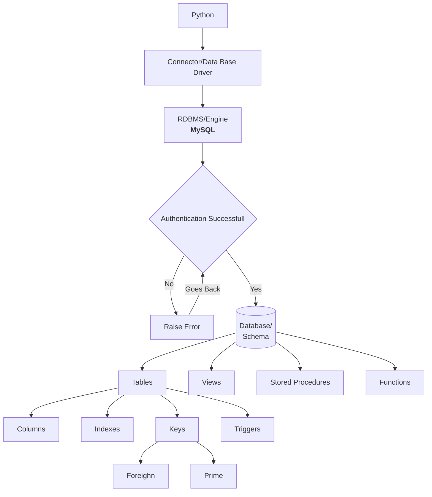
From Python you can use one of the [connectors/database drivers](#ways-to-connect-python-and-mysql), there are many more connectors the connectors/database drivers](#ways-to-connect-python-and-mysql) just shows some of them. The connectors would specify the type of RDMBS (`MySQL, PostgreSQL etc..`) to be used, some connectors are made specific for a particular RDMBS like `mysql.connector` that is only made for MySQL whilst others like `SQLAlchemy` can connect to more variety of RDMBS like `MySQL, PostgreSQL, Oracle, SQlite etc..` Once a connection is established the user can access a variety of schema or chemas. There are four main components of the schema of which are **Tables, Views, Stored Procedures and Functions**. To find another explanation to **Tables, Views, Stored Procedures and Functions** you watch the [Youtube Video](https://www.youtube.com/watch?v=iOHOF4-GWzQ&ab_channel=Andela) from the hyperlink. 
* **Tables:** Tables are database objects that contain all the data in a database. In tables, data is logically organized in a row-and-column format similar to a spreadsheet. Each row represents a unique record, and each column represents a field in the record.

    Resources:
    * [Tables](https://docs.microsoft.com/en-us/sql/relational-databases/tables/tables?view=sql-server-ver16)
    * [MySQL Table](https://www.ntchosting.com/encyclopedia/databases/mysql/database-table/#:~:text=In%20order%20to%20provide%20proper,could%20imagine%20a%20MySQL%20table.)

    **Managing Tables:** 
    Managing Tables in SQL enables you to edit, delete and add data. There is a list of operations which allow you to keep your data optimized and updated. Some of the basic operations are:

    * [Create Table](https://dev.mysql.com/doc/refman/8.0/en/create-table.html)
    * [Insert Table](https://dev.mysql.com/doc/refman/8.0/en/insert.html)
    * [Select Table](https://dev.mysql.com/doc/refman/8.0/en/insert.html)
    * [Update Table](https://dev.mysql.com/doc/refman/8.0/en/update.html)
    * [Delete Table](https://dev.mysql.com/doc/refman/8.0/en/delete.html)

* **Views:** A database object or virtual table that is made up of a query or complex set of queries. In the cases where there are multiple tables and relationships we can create a VIEW by giving certain conditions that will simplify the complexity. Another purpose of using VIEWS is to add to the secuirty mechanism as you can allow certain users to access the VIEW tables. Lastly VIEWS can simplify [legacy code](https://understandlegacycode.com/blog/what-is-legacy-code-is-it-code-without-tests/). Refactoring a table that would break a lot of code can be replaced by a table with a VIEW of the same name. The view provides the exact same schema as the original table, while the actual schema has changed. This keeps the legacy code that references the table from breaking, allowing you to change the legacy code at your leisure.
    
    Resources

    * [Learn MySQL: The Basics of MySQL Stored Procedures](https://www.sqlshack.com/learn-mysql-the-basics-of-mysql-stored-procedures/#:~:text=To%20view%20the%20list%20of,functions%20created%20on%20the%20database.)

    * [Why do you create a View in a database?](https://stackoverflow.com/questions/1278521/why-do-you-create-a-view-in-a-database)

    Syntax for a VIEW:
    ```sql
    CREATE VIEW "Name" AS 
    SELECT <columns>
    FROM <table name> 
    WHERE ... 
    ```
* **Stored Procedures:**
  A stored procedure is a prepared SQL code that you can save, so the code can be reused over and over again. So if you have an SQL query that you write over and over again, save it as a stored procedure, and then just call it to execute it.

  Resources
  * [What are the differences between Stored procedures and functions?](https://www.tutorialspoint.com/what-are-the-differences-between-stored-procedures-and-functions)
  * [SQL Stored Procedures](https://www.w3schools.com/sql/sql_stored_procedures.asp#:~:text=What%20is%20a%20Stored%20Procedure,call%20it%20to%20execute%20it.)
  * [stored procedure](https://www.techtarget.com/searchoracle/definition/stored-procedure)
  * [Stored Procedure in SQL: Benefits And How to Create It](https://www.simplilearn.com/tutorials/sql-tutorial/stored-procedure-in-sql)

   ```sql 
    CREATE PROCEDURE <name>
    AS
    SELECT <columns> FROM <table name>
    GO;
   ```
   Execute Procedure:
   ```sql
   EXEC <procedure name>;
   ```
* **Functions:** Functions can contain SQL statements, queries or made to process some data and return a single scalar value or a resultset. Functions are usefull when formatting values like dates and for repeated tasks. Functions always return values unlike stored procedures. 

   ```sql 
   CREATE FUNCTION <name> ()
   RETURNS <ANY DATA Type>
   BEGIN 
   RETURN <Value>
   END 
   ```
* **Stored procedure vs. function**
Stored procedures and functions can be used to accomplish the same task. Both can be custom-defined as part of any application, but functions are designed to send their output to a query or T-SQL statement. Stored procedures are designed to return outputs to the application, while a user-defined function returns table variables and cannot change the server environment or operating system environment. To see all the differences between functions and stored procedures click the hyperlink [What are the differences between Stored procedures and functions?](https://www.tutorialspoint.com/what-are-the-differences-between-stored-procedures-and-functions). 

#### Table Components 
Resources 
* [Advanced SQL - Indexes and Triggers](https://blog.webnersolutions.com/advanced-sql-indexes-and-triggers/#:~:text=A%20trigger%20is%20the%20most,table%20columns%20are%20being%20updated.)
* [Difference between SQL Keys (Primary Key, Super Key, Candidate Key, Foreign Key)](https://www.analyticsvidhya.com/blog/2020/07/difference-between-sql-keys-primary-key-super-key-candidate-key-foreign-key/#:~:text=An%20SQL%20key%20is%20either,multiple%20tables%20in%20the%20database.)

There are four components to tables Indexes, Triggers, Colums and Keys. The bullet points below goes over what and the utility of each one of the table components:

* **Indexes:** In the SQL database Index is like a schema object. It is used to fetch records from the database in a fast manner. With the help of the index, we can optimize our database performance. We can create an index on existing tables or views.
* **Triggers:** A trigger is the most important part of the SQL. It is a special type of stored-procedure which automatically runs when an event occurs in the database.For Example, a trigger can be executed when a row is inserted into a specified table or when certain table columns are being updated. We apply a trigger on the table or view.
* **Columns:** Categories of values presented as rows are organized and seperated by columns.
* **Keys:** Manage records so that recognition of having unique data can be found. As well as relating the multiple tables that are present in the database. There are many sort of keys in SQL, the table below outline and describes some of them: 

|Key|Description|
|---|---|
|[Super Key](https://www.analyticsvidhya.com/blog/2020/07/difference-between-sql-keys-primary-key-super-key-candidate-key-foreign-key/#h2_5)|Super key is a single key or a group of multiple keys that can uniquely identify tuples in a table.|
|[Candidate key](https://www.analyticsvidhya.com/blog/2020/07/difference-between-sql-keys-primary-key-super-key-candidate-key-foreign-key/#h2_6)|Candidate key is a single key or a group of multiple keys that uniquely identify rows in a table.|
|[Primary key](https://www.analyticsvidhya.com/blog/2020/07/difference-between-sql-keys-primary-key-super-key-candidate-key-foreign-key/#h2_7)|Primary key is the Candidate key selected by the database administrator to uniquely identify tuples in a table.|
|[Alternate keys](https://www.analyticsvidhya.com/blog/2020/07/difference-between-sql-keys-primary-key-super-key-candidate-key-foreign-key/#h2_8)|Alternate keys are those candidate keys which are not the Primary key.|
|[Foreign key](https://www.analyticsvidhya.com/blog/2020/07/difference-between-sql-keys-primary-key-super-key-candidate-key-foreign-key/#h2_9)|Foreign key is an attribute which is a Primary key in its parent table, but is included as an attribute in another host table.|
|[Composite key](https://www.analyticsvidhya.com/blog/2020/07/difference-between-sql-keys-primary-key-super-key-candidate-key-foreign-key/#h2_11) |A Composite key is a Candidate key or Primary key that consists of more than one attribute.|

For a more descriptive explanation click the hyperlink [Difference between SQL Keys (Primary Key, Super Key, Candidate Key, Foreign Key)](https://www.analyticsvidhya.com/blog/2020/07/difference-between-sql-keys-primary-key-super-key-candidate-key-foreign-key/#:~:text=An%20SQL%20key%20is%20either,multiple%20tables%20in%20the%20database.).

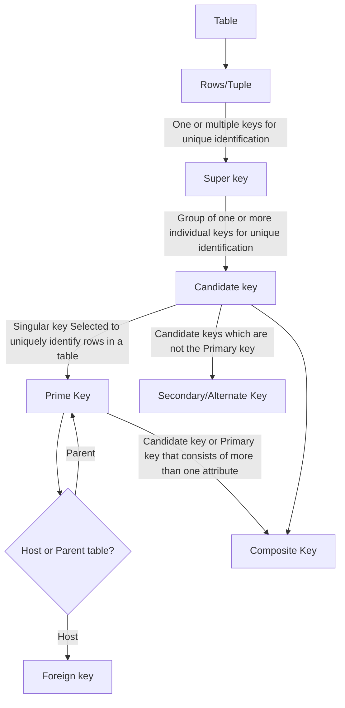

#### ORM and SQL
Resources 
* [What is an ORM, how does it work, and how should I use one?](https://stackoverflow.com/questions/1279613/what-is-an-orm-how-does-it-work-and-how-should-i-use-one)

Object-Relational Mapping (ORM) is a technique that lets you query and manipulate data from a database using an object-oriented paradigm. When talking about ORM, most people are referring to a library that implements the Object-Relational Mapping technique, hence the phrase "an ORM". 

An ORM library is a completely ordinary library written in your language of choice that encapsulates the code needed to manipulate the data, so you don't use SQL anymore; you interact directly with an object in the same language you're using.
#### Ways to Connect Python and SQL

|Connector|Utility and Description|
|---|---|
|[SQLAlchemy](https://docs.sqlalchemy.org/en/13/index.html)|SQLAlchemy is an ORM that facilitates communication between Python and other SQL databases. You can create different engines for different databases like MySQL, PostgreSQL, SQLite, and so on. SQLAlchemy is commonly used alongside the pandas library to provide complete data-handling functionality.|
|[Django ORM](https://books.agiliq.com/projects/django-orm-cookbook/en/latest/introduction.html)|Django ORM is one of the most powerful features of Django and is supplied alongside the Django web framework. It can interact with a variety of databases such as SQLite, PostgreSQL, and MySQL. Many Django-based applications use the Django ORM for data modeling and basic queries but often switch to SQLAlchemy for more complex requirements.|
|[CyMySQL](https://github.com/nakagami/CyMySQL)|CyMySQL accerarates by Cython, and support not only python 2 but also python 3. It still can work without Cython as a pure python driver.It is a fork project from [PyMySQL](https://pymysql.readthedocs.io/en/latest/).|
### Project Objective: MySQL

## Mongo DB 
Resource:
* [Mongo DB Tutorial](https://www.tutorialspoint.com/mongodb/mongodb_overview.htm)

MongoDB is a cross-platform, document oriented database that provides, high performance, high availability, and easy scalability. MongoDB works on concept of collection and document. To learn more about Mongo DB check the [About Mongo DB](#about-mongo-db) section of the document, to undertand how the project utilises Mongo DB check out [Project Objective Mongo DB](#project-objective-mongo-db). 

### **About Mongo DB**


Mongo DB has three main components a **database, collection** and **documents**. Classified as a NoSQL database program, MongoDB uses JSON-like documents with optional schemas.

#### **Overview**

**Database**
Database is a physical container for collections. Each database gets its own set of files on the file system. A single MongoDB server typically has multiple databases.

**Collection**
Collection is a group of MongoDB documents. It is the equivalent of an RDBMS table. A collection exists within a single database. Collections do not enforce a schema. Documents within a collection can have different fields. Typically, all documents in a collection are of similar or related purpose.

**Document**
A document is a set of key-value pairs. Documents have dynamic schema. Dynamic schema means that documents in the same collection do not need to have the same set of fields or structure, and common fields in a collection's documents may hold different types of data. If you don’t provide then MongoDB provides a unique id for every document.

**Comparing RDMBS and Mongo DB**

|RDBMS|MongoDB|
|---|---|
|Database|Database|
|Table|Collection|
|Tuple/Row|Document|
|Column|Field|
|Table Join|Embedded Documents|
|Primary Key|Primary Key (Default key _id provided by MongoDB itself)|
|Database Server and Client|
|mysqld/Oracle|mongod|
|mysql/sqlplus|	mongo|

In MongoDB there is no concept of relationship. So table joins are not possible. 

#### **Data Models**
Resources:
* [Data Modeling](https://www.tutorialspoint.com/mongodb/mongodb_data_modeling.htm)

There are 2 types of data models in Mongo DB:
* **Embedded Data Model:** In this model, you can have (embed) all the related data in a single document, it is also known as denormalized data model.

    **Example of a Embedded Data Model:**
    ```json
    {
        _id: ,
        Emp_ID: "10025AE336"
        Personal_details:{
            First_Name: "Radhika",
            Last_Name: "Sharma",
            Date_Of_Birth: "1995-09-26"
        },
        Contact: {
            e-mail: "radhika_sharma.123@gmail.com",
            phone: "9848022338"
        },
        Address: {
            city: "Hyderabad",
            Area: "Madapur",
            State: "Telangana"
        }
    }
    ```
* **Normalized Data Model:** In this model, you can refer the sub documents in the original document, using references. 

    **Example of a Embedded Data Model:**
    > **_NOTE:_**   The data model is based on the example of the **Embedded Data Model**. The **Employee** structure is broken into three sections being **Personal_details**, **Contact** and **Address**. The sections are referenced by **_id**.

    **Employee:**
    ```json
    {
        _id: <ObjectId101>,
        Emp_ID: "10025AE336"
    }
    ```
    **Personal_details:**
    ```json 
    {
        _id: <ObjectId102>,
        empDocID: " ObjectId101",
        First_Name: "Radhika",
        Last_Name: "Sharma",
        Date_Of_Birth: "1995-09-26"
    }
    ```
    **Contact:**
    ```json
    {
        _id: <ObjectId103>,
        empDocID: " ObjectId101",
        e-mail: "radhika_sharma.123@gmail.com",
        phone: "9848022338"
    }
    ```
    **Address:**
    ```json
    {
        _id: <ObjectId104>,
        empDocID: " ObjectId101",
        city: "Hyderabad",
        Area: "Madapur",
        State: "Telangana"
    } 
    ```
#### **Create and Drop Data Bases**

The first process is to create a database in Mongo DB. The database can be created with the `use (DB Name)` command. The `use (DB Name)` command can also be used to select a database. Once a database is created it will show up in the list of databases, use the `shows dbs` command to see the list of databases. In order for a newly created DB to show up in the `show dbs` command, it has to have atleast one collection. The command `(collection name).insert({"name": "(collection name)"})` to create a collection, more information is present within the [collections](#create-and-drop-collections) section below. The selected database and can be viewed with the `db` command, which would output the name of the database selected. To drop the selected database use the `db.dropDatabase()` command after a database is selected. Dropping the database will erase all records of it including the contents and the database name.  

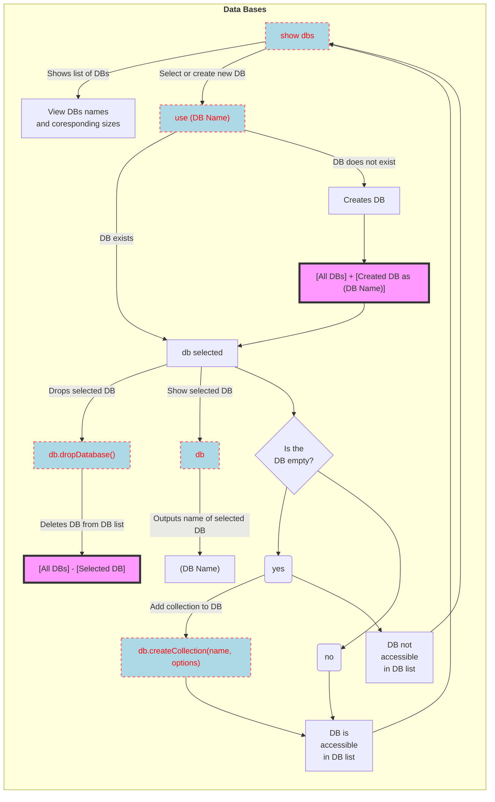
  > **_NOTE:_**  For the diagram above the boxes with the blue background and the red text are meant to represent commands from the [Mongo DB Command Descriptions](#mongo-db-command-descriptions) table. The text boxes with the purple background and the black outline are representitive of the operations. 

#### **Create and Drop Collections**

After the databases are established we can start by placing collections within the database. The basic syntax to create a collection is `db.createCollection(name, options)`. The only mandatory parameter when it comes to creating of the collections is the name of the collection. The optional parameters can be specified in the type of document. The optional parameters include [`capped`,`autoIndexId`,`size`,`max`]. The description of the optional and mandatory parameters with their descriptions are as follows:

|Parameter|Type|Description|
|----|----|----|
Name|String|Name of the collection to be created.
|Options|Document|<table>  <thead>  <tr>  <th>Field</th>  <th>Type</th> <th>Description</th>  </tr>  </thead>  <tbody>  <tr>  <td>capped</td>  <td>Boolean</td>  <td>	(Optional) If true, enables a capped collection. Capped collection is a fixed size collection that automatically overwrites its oldest entries when it reaches its maximum size. If you specify true, you need to specify size parameter also.</td>  </tr>  <tr>  <td>autoIndexId</td>  <td>Boolean</td>  <td>(Optional) If true, automatically create index on _id field.s Default value is false.</td>  </tr>  <tr>  <td>size</td>  <td>number</td>  <td>(Optional) Specifies a maximum size in bytes for a capped collection. If capped is true, then you need to specify this field also.</td>  </tr> <tr>  <td>max</td>  <td>number</td>  <td>(Optional) Specifies the maximum number of documents allowed in the capped collection.</td>  </tr> </tbody>  </table>|

To see the list of collection values you can use the `show collections` command. To erase all contents of the collections use the `db.COLLECTION_NAME.drop()` command. 


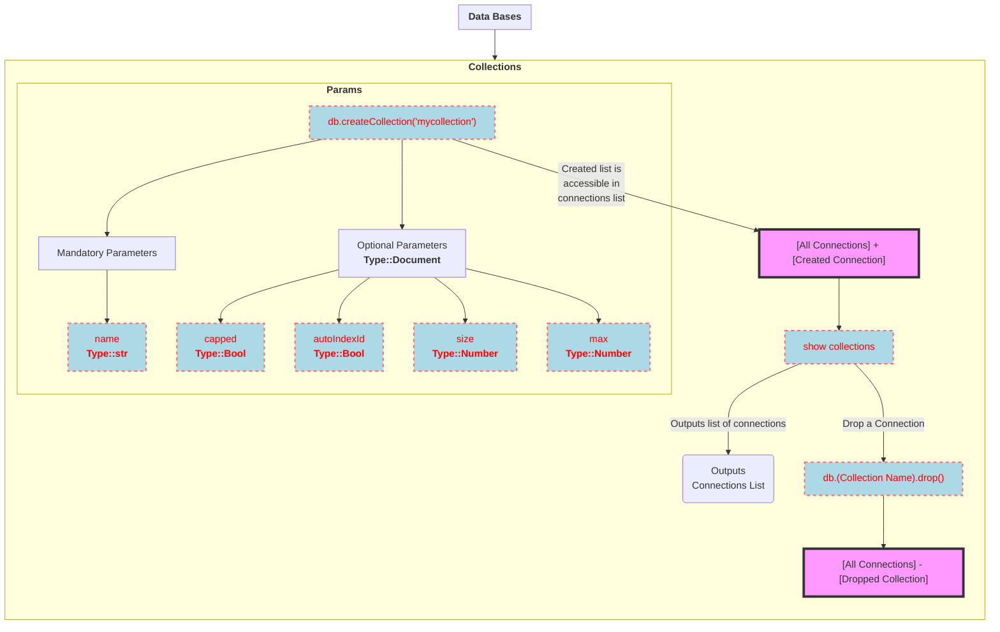

#### **Data Types**

|Data Type|Description|
|---|---|
|`String`|This is the most commonly used datatype to store the data. String in MongoDB must be UTF-8 valid.|
|`Integer`|This type is used to store a numerical value. Integer can be 32 bit or 64 bit depending upon your server.|
|`Boolean`|This type is used to store a boolean (true/ false) value.|
|`Double`|This type is used to store floating point values.|
|`Min/ Max keys`|This type is used to compare a value against the lowest and highest BSON elements.|
|`Arrays`|This type is used to store arrays or list or multiple values into one key.|
|`Timestamp`|ctimestamp. This can be handy for recording when a document has been modified or added.|
|`Object`|This datatype is used for embedded documents.|
|`Null`|This type is used to store a Null value.|
|`Symbol`|This datatype is used identically to a string; however, it's generally reserved for languages that use a specific symbol type.|
|`Date`|This datatype is used identically to a string; however, it's generally reserved for languages that use a specific symbol type.|
|`Object ID`|This datatype is used to store the document’s ID.|
|`Binary data`|This datatype is used to store binary data.|
|`Code`|This datatype is used to store JavaScript code into the document.|
|`Regular expression`|This datatype is used to store regular expression.|


#### **Inserting, Querying, Updating and Deleting Documents**

**Inserting**
Resources:
* [Inserting Documents](https://www.tutorialspoint.com/mongodb/mongodb_insert_document.htm)

There are two methods when it comes to inserting documents in collections. The two methods being the **insert()** and **save()**. The syntaxes for the methods are as follows `db.COLLECTION_NAME.insert(document)`, `db.COLLECTION_NAME.save(document)`. In both methods the Collection and the document contents have to be specified. If the collection does not exist within the **insert()** or **save()** methods the collection will be automatically created. In the inserted document, if we don't specify the `_id` parameter, then MongoDB assigns a unique `ObjectId` for this document. In the inserted document, in both the `save()` and `insert()` methods if we don't specify the `_id` parameter, then MongoDB assigns a unique `ObjectId` for this document. `_id` is 12 bytes hexadecimal number unique for every document in a collection. 

**Example of Insert Statement**

```json 
> db.users.insert({
... _id : ObjectId("507f191e810c19729de860ea"),
... title: "MongoDB Overview",
... description: "MongoDB is no sql database",
... by: "tutorials point",
... url: "http://www.tutorialspoint.com",
... tags: ['mongodb', 'database', 'NoSQL'],
... likes: 100
... })
WriteResult({ "nInserted" : 1 })
>
```
Furthermore, a specified amount of documents to be inserted into a collection can be used with the `insertOne()` or the `insertMany()` methods. The syntax for the `insertOne()` method is `db.COLLECTION_NAME.insertOne(document)`, it is used for inserting a single document. It needs a document to be passed as an argument. The syntax for the `insertMany` method is `db.COLLECTION_NAME.insertMany(document)`, Used for inserting multiple documents. Needs and array to be passed as an argument. 

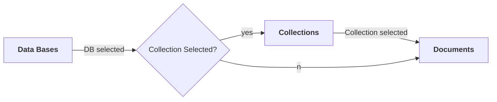


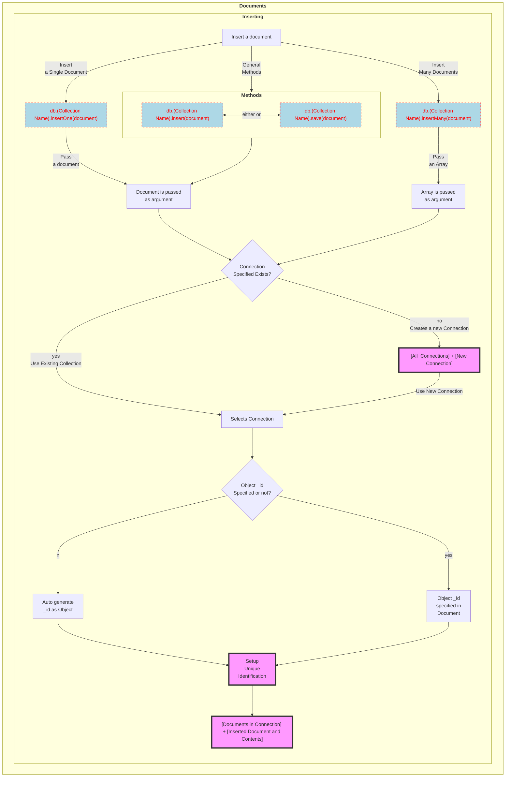
**Querying**
Resources:
* [Query Documents](https://www.tutorialspoint.com/mongodb/mongodb_query_document.htm)

Querying data from MongoDB collection, you need to use MongoDB's `find()` method. Displaying the results in a formatted way, you can use `pretty()` method. Apart from the `find()` method, there is `findOne()` method, that returns only one document. Whereas the `find()` method by itself will print all the documents in the collection at once. To further add formats whilst querying documents, logical gates could be used, these gates consists of `AND, OR, NOT` gates etc. Gates could be further conjoined with operators.  Operator consists of `equals, greater than, greater than equal ..etc`. Multiple gates and operators could be used to create formatted queries. The tables for the [Logic Gates](#table-for-logic-gates) and [Operators](#table-for-operations) are linked down below. 


```json
> db.mycol.find()
{ "_id" : ObjectId("5dd4e2cc0821d3b44607534c"), "title" : "MongoDB Overview", "description" : "MongoDB is no SQL database", "by" : "tutorials point", "url" : "http://www.tutorialspoint.com", "tags" : [ "mongodb", "database", "NoSQL" ], "likes" : 100 }
{ "_id" : ObjectId("5dd4e2cc0821d3b44607534d"), "title" : "NoSQL Database", "description" : "NoSQL database doesn't have tables", "by" : "tutorials point", "url" : "http://www.tutorialspoint.com", "tags" : [ "mongodb", "database", "NoSQL" ], "likes" : 20, "comments" : [ { "user" : "user1", "message" : "My first comment", "dateCreated" : ISODate("2013-12-09T21:05:00Z"), "like" : 0 } ] }
>
```
**Pretty Printing**
```json 
> db.mycol.find().pretty()
{
	"_id" : ObjectId("5dd4e2cc0821d3b44607534c"),
	"title" : "MongoDB Overview",
	"description" : "MongoDB is no SQL database",
	"by" : "tutorials point",
	"url" : "http://www.tutorialspoint.com",
	"tags" : [
		"mongodb",
		"database",
		"NoSQL"
	],
	"likes" : 100
}
```

**Example Using the `findOne()` Command**

Using the example of `mycol` above the code iterates a single document that contains the title `"MongoDb Overview"` 

```json
> db.mycol.findOne({title: "MongoDB Overview"})
{
	"_id" : ObjectId("5dd6542170fb13eec3963bf0"),
	"title" : "MongoDB Overview",
	"description" : "MongoDB is no SQL database",
	"by" : "tutorials point",
	"url" : "http://www.tutorialspoint.com",
	"tags" : [
		"mongodb",
		"database",
		"NoSQL"
	],
	"likes" : 100
}
```


**Utilizing Logic Gates and Operations**

#### **Table for Logic Gates**

|Logic Gate|Syntax|Example|Example Description
|---|---|---|---|
|**AND**|`db.mycol.find({ $and: [ {<key1>:<value1>}, { <key2>:<value2>} ] })`|`db.mycol.find({$and:[{"by":"tutorials point"},{"title": "MongoDB Overview"}]})`|Shows all the tutorials written by 'tutorials point' and whose title is 'MongoDB Overview'.|
|**OR**|`db.mycol.find({ $or: [ {<key1>:<value1>}, { <key2>:<value2>} ] })`|`db.mycol.find({$or:[{"by":"tutorials point"},{"title": "MongoDB Overview"}]})`|Shows all the tutorials written by 'tutorials point' or whose title is 'MongoDB Overview'.|
|Multi Logic eg. **AND & OR**|`db.mycol.find({key1: value1},$or: {[ {<key2>:<value2>}, { <key3>:<value3>} ] })`|`db.mycol.find({"likes": {$gt:10}, $or: [{"by": "tutorials point"},{"title": "MongoDB Overview"}]})`|Where likes>10 AND (by = 'tutorials point' OR title = 'MongoDB Overview'.|
|**NOT**|`db.mycol.find({ $not: [ {<key1>:<value1>}, { <key2>:<value2>} ] })`|` db.empDetails.find( { "Age": { $not: { $gt: "25" } } } )`|Retrieve the document(s) whose age is not greater than 25.|

#### **Table for Operations**
                    
Operation|	Syntax|	Example| RDBMS Equivalent
|---|---|---|---|
Equality|	`{(key):{$eg;(value)}}`|	`db.mycol.find({"by":"tutorials point"}).pretty()`|	where by = 'tutorials point'
Less Than|	`{(key):{$lt:(value)}}`|	`db.mycol.find({"likes":{$lt:50}}).pretty()`|	where likes < 50
Less Than Equals|	`{(key):{$lte:(value)}}`|	`db.mycol.find({"likes":{$lte:50}}).pretty()`|	where likes <= 50
Greater Than|	`{(key):{$gt:(value)}}`|	`db.mycol.find({"likes":{$gt:50}}).pretty()`|	where likes > 50
Greater Than Equals|	`{(key):{$gte:(value)}}`|	`db.mycol.find({"likes":{$gte:50}}).pretty()`|	where likes >= 50
Not Equals|	`{(key):{$ne:(value)}}`|	`db.mycol.find({"likes":{$ne:50}}).pretty()`|	where likes != 50
Values in an array|	`{(key):{$in:[(value1), (value2),……(valueN)]}}`|	`db.mycol.find({"name":{$in:["Raj", "Ram", "Raghu"]}}).pretty()`|	Where name matches any of the value in :`["Raj", "Ram", "Raghu"]`.
Values not in an array|	`{(key):{$nin:(value)}}`|	`db.mycol.find({"name":{$nin:["Ramu", "Raghav"]}}).pretty()`|	Where name values is not in the array :`["Ramu", "Raghav"]` or, doesn’t exist at all.

**Using Projections**

```json 
{_id : ObjectId("507f191e810c19729de860e1"), title: "MongoDB Overview"},
{_id : ObjectId("507f191e810c19729de860e2"), title: "NoSQL Overview"},
{_id : ObjectId("507f191e810c19729de860e3"), title: "Tutorials Point Overview"}
db.mycol.find({},{"title":1,_id:0})
{"title":"MongoDB Overview"}
{"title":"NoSQL Overview"}
{"title":"Tutorials Point Overview"}
```

```mermaid
flowchart TB
subgraph ide1 [<b>Documents]
    subgraph ide3 [<b>Querying]
        subgraph ide4 [<b>Filteration and Formats]
            a24[Create Logical Clause] --> a26
            a26{Utilize More<br>than one<br>Gate?}

            a22["Conditions<br><b>AND,OR..."]:::operation

            a26 --yes--> a27[Multiple Logic<br>Parameter]
            a26 --no--> a28[Singular Logic<br>Parameter]
            a28 -->  a22
            a27 --> a22

            a22 --Conditions<br>can be joined<br>with operations--> a29{Use Operations for Gates?}
            a29 --yes--> a23[Operations<br><b>Greater Than,<br><b>Greater Than Equals,<br><b>Equals...]:::operation
            a29 --no--> a25 
            a23 --> a22

            a25{Finished Logical<br>Clause Parameters?}
            a25 --yes--> a30[Return Clause]:::operation
            a25 --no--> a27
        end
      
        a17[Document Display Formats] --Takes in<br>All Available<br>Documents--> a15
        a17 --Takes in a<br>Single Document--> a20["db.(Collection Name).findOne()"]:::codeclass
        a20 --> a21
        a15["db.(Collection Name).find()"]:::codeclass
        a15 --> a21{Use Conditional<br>Formatting?}
        
        a21 --yes<br>Formats--> ide4 --> a32{"Limit Fields?"}
        a32 --yes--> a33["db.COLLECTION_NAME.find({},{KEY:1})"]:::codeclass
        a33 --Hide Field--> a34["{KEY:0}"]:::codeclass
        a33 --Show Field--> a35["{KEY:1}"]:::codeclass
        a34 --> a36["Join All Fields Together<br>{KEY:1/0, KEY:1/0 ...}"]:::operation
        a35 --> a36
        a32 --no<br>Fields--> a31{Pretty Print or Not?}
        a36 --> a31
        a21 --no<br>Formats--> a32

        a31 --no<br>Displaying--> a16[Prints Document/s<br>in a Collection]
        a18[".find().pretty()"]:::codeclass
        a31 --yes<br>Pretty Print-->a18 --Displaying--> a19[Prints Document/s<br>in a Collection<br>in Pretty Format]
    end

    classDef codeclass fill:lightblue,color:red,stroke:#f66,stroke-width:2px,stroke-dasharray: 5 5; 
    classDef operation fill:#f9f,stroke:#333,stroke-width:4px; 
end
```


#### Updating
Resources:
* [Update Document](https://www.tutorialspoint.com/mongodb/mongodb_update_document.htm)
* [Delete Document](https://www.tutorialspoint.com/mongodb/mongodb_delete_document.htm)
* [Difference between update(), updateOne() and updateMany() in MongoDB](https://www.dbgenre.com/post/difference-between-update-updateone-and-updatemany-in-mongodb)
* [mongoose difference of findOneAndUpdate and update](https://stackoverflow.com/questions/31808786/mongoose-difference-of-findoneandupdate-and-update#:~:text=Performance%3F&text=One%20additional%20difference%3A%20when%20using,the%20query%20in%20the%20latter)
* [What is the difference between update(), updateOne() and updateMany() in MongoDB?](https://www.quora.com/What-is-the-difference-between-update-updateOne-and-updateMany-in-MongoDB)

MongoDB's `update()` and `save()` methods are used to update document into a collection. The `update()` method updates the values in the existing document while the `save()` method replaces the existing document with the document passed in `save()` method. By default, MongoDB will update only a single document. To update multiple documents, you need to set a parameter `'multi'` to true. The `save()` method replaces the existing document with the new document passed in the `save()` method. The `updateOne()` methods updates a single document which matches the given filter whilst the `updateMany()` method updates all the documents that matches the given filter. There is also an optional parameter for projections with the `find()` method, the second parameter is the list of fields you want to retrieve. The limiting parameters are the list of fields with value 1 or 0. 1 is used to show the field while 0 is used to hide the fields.

So to summarize:

* `updateMany()` : It updates all documents in a collection with matching filter.

* `updateOne()` : It updates only one top most document in a collection with matching filter.

* `update()` : By default, the `update()` method updates a single document. Include the option `{multi : true}` to update all documents that match the query criteria. Hence, we can use it as both ways.

Examples of Updating Documents

**Using `updateMany()`**

```json
> db.empDetails.find().pretty()
{
        "_id" : ObjectId("62ea9b64b13a229c9b0ce583"),
        "First_Name" : "Radhika",
        "Last_Name" : "Sharma",
        "Age" : "26",
        "e_mail" : "radhika_sharma.123@gmail.com",
        "phone" : "9000012345"
}
{
        "_id" : ObjectId("62ea9b64b13a229c9b0ce584"),
        "First_Name" : "Rachel",
        "Last_Name" : "Christopher",
        "Age" : "27",
        "e_mail" : "Rachel_Christopher.123@gmail.com",
        "phone" : "9000054321"
}
> db.empDetails.updateMany(
	{Age:{ $gt: "25" }},
	{ $set: { Age: '00'}})
```
Updates all the documents that have the parameter `Age` that is greater than 25 to be updated into the new `Age`. 


**Using `updateOne()` and `findOne`**

```json
>db.empDetails.updateOne(
	{ $set: { Age: '30',e_mail: 'emailrad@gmail.com'}}
)
> db.empDetails.findOneAndUpdate(
	{First_Name: 'Radhika'},
	{ $set: { Age: '30',e_mail: 'radhika_newemail@gmail.com'}}
)
```
Updates the age and email values of the document with name 'Radhika'.

**Using `update()`**

```json
{ "_id" : ObjectId(5983548781331adf45ec5), "title":"MongoDB Overview"}
{ "_id" : ObjectId(5983548781331adf45ec6), "title":"NoSQL Overview"}
{ "_id" : ObjectId(5983548781331adf45ec7), "title":"Tutorials Point Overview"}
>db.mycol.update({'title':'MongoDB Overview'},{$set:{'title':'New MongoDB Tutorial'}})
>db.mycol.find()
{ "_id" : ObjectId(5983548781331adf45ec5), "title":"New MongoDB Tutorial"}
{ "_id" : ObjectId(5983548781331adf45ec6), "title":"NoSQL Overview"}
{ "_id" : ObjectId(5983548781331adf45ec7), "title":"Tutorials Point Overview"}
```
Sets the new title 'New MongoDB Tutorial' of the documents whose title is 'MongoDB Overview'.
```json 
>db.mycol.update({'title':'MongoDB Overview'},
   {$set:{'title':'New MongoDB Tutorial'}},{multi:true})
```
To update multiple documents at once 

**Using `save()`**

```json
{ "_id" : ObjectId(5983548781331adf45ec5), "title":"New MongoDB Tutorial"}
{ "_id" : ObjectId(5983548781331adf45ec6), "title":"NoSQL Overview"}
{ "_id" : ObjectId(5983548781331adf45ec7), "title":"Tutorials Point Overview"}
>db.mycol.save(
   {
      "_id" : ObjectId("5983548781331adf45ec5"), 
		"title":"Tutorials Point New Topic",
      "by":"Tutorials Point"
   }
)
>db.mycol.find()
{ "_id" : ObjectId("5983548781331adf45ec5"), "title":"Tutorials Point New Topic",
   "by":"Tutorials Point"}
{ "_id" : ObjectId("5983548781331adf45ec6"), "title":"NoSQL Overview"}
{ "_id" : ObjectId("5983548781331adf45ec7"), "title":"Tutorials Point Overview"}
```
Replaces the document with the _id '5983548781331adf45ec5'. If the selected `_id` is not specified adds the new document to the collection. 

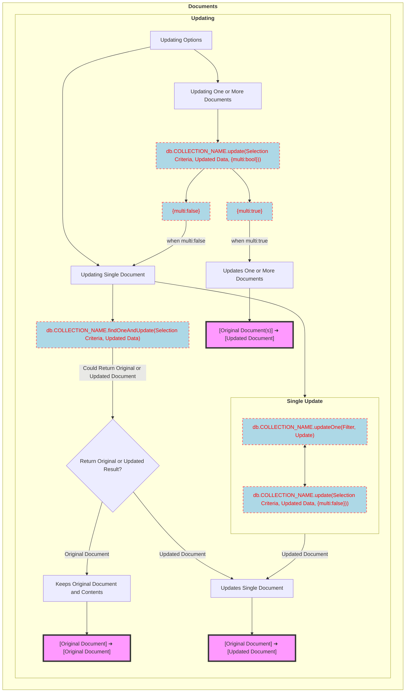
#### Deleting
Resources:
* [Delete Document](https://www.tutorialspoint.com/mongodb/mongodb_delete_document.htm)

The `remove()` method is used to remove a document from the collection. `remove()` method accepts two parameters. One is deletion criteria and second is `justOne` flag.

1. `Deletion criteria` − (Optional) deletion criteria according to documents will be removed.

2. `justOne` − (Optional) if set to true or 1, then remove only one document.

If there are multiple records, and you want to delete only the first record, then set `justOne` parameter in remove() method. If you don't specify deletion criteria, then MongoDB will delete whole documents from the collection. 

**Using `remove()`**

```json 
{_id : ObjectId("507f191e810c19729de860e1"), title: "MongoDB Overview"},
{_id : ObjectId("507f191e810c19729de860e2"), title: "NoSQL Overview"},
{_id : ObjectId("507f191e810c19729de860e3"), title: "Tutorials Point Overview"}
>db.mycol.remove({'title':'MongoDB Overview'})
WriteResult({"nRemoved" : 1})
```
Removes the document with the title `MongoDB Overview`.

```json 
>db.COLLECTION_NAME.remove(DELETION_CRITERIA,1)
```
Syntax for removing only one document. 

```json 
> db.COLLECTION_NAME.remove({})
```
Removes all documents in the collection. 

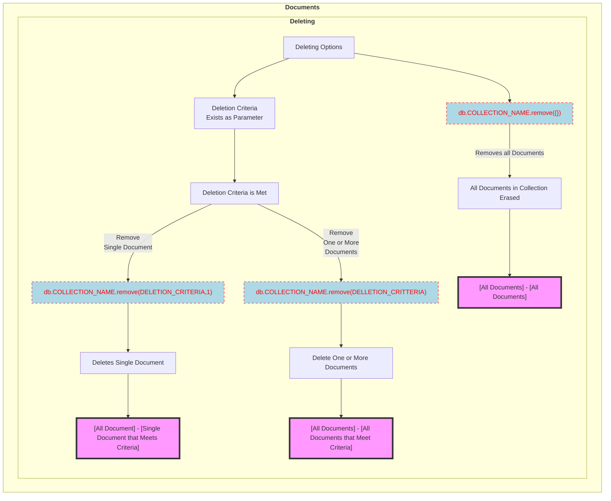

#### **Limiting and Sorting Records** 

**Limiting**
Resources:
* [Limiting Records](https://www.tutorialspoint.com/mongodb/mongodb_limit_record.htm)

To limit the records in MongoDB, you need to use `limit()` method. The method accepts one number type argument, which is the number of documents that you want to be displayed. If the limit number is not specified it will just print all the documents in the collection. Another method is `skip()` which also accepts number type argument and is used to skip the number of documents.

**Example with `limit()` and `skip()`**

```json 
{_id : ObjectId("507f191e810c19729de860e1"), title: "MongoDB Overview"},
{_id : ObjectId("507f191e810c19729de860e2"), title: "NoSQL Overview"},
{_id : ObjectId("507f191e810c19729de860e3"), title: "Tutorials Point Overview"}
>
>db.mycol.find({},{"title":1,_id:0}).limit(2)
{"title":"MongoDB Overview"}
{"title":"NoSQL Overview"}
>
>db.mycol.find({},{"title":1,_id:0}).limit(1).skip(1)
{"title":"NoSQL Overview"}
```

**Sorting Records**

The `sort()` method accepts a document containing a list of fields along with their sorting order. To specify sorting order 1 and -1 are used. 1 is used for ascending order while -1 is used for descending order. If not specified the `sort()` method will display the documents in ascending order.

```json 
{_id : ObjectId("507f191e810c19729de860e1"), title: "MongoDB Overview"}
{_id : ObjectId("507f191e810c19729de860e2"), title: "NoSQL Overview"}
{_id : ObjectId("507f191e810c19729de860e3"), title: "Tutorials Point Overview"}
>db.mycol.find({},{"title":1,_id:0}).sort({"title":-1})
{"title":"Tutorials Point Overview"}
{"title":"NoSQL Overview"}
{"title":"MongoDB Overview"}
>
```
Displaying the documents sorted by title in the descending order.

#### **Mongo DB Command Descriptions**

|Command|Description|
|---|---|
|`use <Data Base Name>`|select a database. If the selected database is not available then a new database will be created.|
|`db`|To check the selected database.|
|`show dbs`|Shows a list of the created databases.|
|`db.dropDatabase()`|Drops the selected database.|
|`db.createCollection("name", { capped : bool, autoIndexID : bool, size : number, max : number })`|Creating collections the name of the collection is given through the `str` name and the options within the `{}` are optional. Detail on the option parameters are found in the [Collections](#create-and-drop-collections) section.|
|`show collections`|Shows a list of the created collections.|
|`db.COLLECTION_NAME.drop()`|Drops the selected collection.|
|`db.COLLECTION_NAME.insert(document)`|Inserting a document to a specified collection.|
|`db.COLLECTION_NAME.save(document)`|Inserts a document to a specified Collection is identical to the `db.COLLECTION_NAME.insert(document)`. The `save()` method replaces the existing document with the new document passed in the `save()` method.|
|`db.COLLECTION_NAME.insertOne(document)`|Used for inserting a single document.|
|`db.COLLECTION_NAME.insertMany(document)`|Used for inserting multiple documents using the `insertMany()` method. Needs an array of documents to be passed.|
|`db.COLLECTION_NAME.find()`|Query all the documents in a collection.|
|`db.COLLECTION_NAME.find().pretty`|Pretty prints all the documents in a collection.|
|`db.COLLECTION_NAME.findOne()`| The `findOne()` method, returns only one document in a collection.|
|`db.COLLECTION_NAME.update(Selection Criteria, Updated Data, ,{multi:bool}))`|By default, the `update()` method updates a single document. Include the option `{multi : true}` to update all documents that match the query criteria.|
|`db.COLLECTION_NAME.findOneAndUpdate(Selection Criteria, Updated Data)`|Finds a single document and updates it, returning either the original or the updated document.|
|`db.COLLECTION_NAME.updateOne(<filter>, <update>)`|Update a single document matching the filter.|
|`db.COLLECTION_NAME.remove(DELLETION_CRITTERIA)`|Deletes all documents that match the deletion criteria.|
|`db.COLLECTION_NAME.remove(DELETION_CRITERIA,1)`|Deletes a single document that matches the deletion criteria.|
|`db.COLLECTION_NAME.remove({})`|Removes all documents in a collection.|
|`db.COLLECTION_NAME.find({},{KEY:1})`|Optional parameters to show the field of a document. After stating the `keys` they will be assigned either 1 or 0. 1 to include specified field and 0 to exclude it.|
|`db.COLLECTION_NAME.find().limit(NUMBER)`|Limiting the number of documents viewable. Shows the first N number of documents.|
|`db.COLLECTION_NAME.find().limit(NUMBER).skip(NUMBER)`|The limiting method usually works with the `skip()` method. The method skips the N number of documents from the top.|
|`db.COLLECTION_NAME.find().sort({KEY:1})`|Sorts the Documents in ascending or descending order in terms of fields. Use 1 for ascending and -1 for descending order.|
|`db.COLLECTION_NAME.createIndex({KEY:1})`||
|``||
|``||
|``||
|``||
|``||
|``||
|``||
|``||
|``||
|``||
|``||

### Project Objective: Mongo DB

## Django 


### About Django 
### Project Objective: Django 

## Sphinx 

The Sphinx Documentation tool will be used to oraganize and present in depth data for each Strategy's configuration. The basics of the Sphinx document is shown below with explained functionality and details. The components are summarised so for more in depth information take a look at the [Tutorial](#about-sphinx).  If you already know about Sphinx you can skip the [About Sphinx](#about-sphinx) section below and go right ahead to [Project Objective: Sphinx](#project-objective-sphinx) to learn about the projects goals and utilities realting to Sphinx. 

#### Resources
* [Sphinx Documentation](https://www.sphinx-doc.org/en/master/index.html)
* [Mermaid Diagrams in Sphinx](https://github.com/mgaitan/sphinxcontrib-mermaid)


### About Sphinx

**Sphinx Directory:**

For more information look at [Setting up your project and development environment](https://www.sphinx-doc.org/en/master/tutorial/getting-started.html)

```
docs
├── build
├── make.bat
├── Makefile
└── source
   ├── conf.py
   ├── index.rst
   ├── _static
   └── _templates
```

**Purpose of Each file:**

|File |Description|
|---|---|
|`build/`|An empty directory (for now) that will hold the rendered documentation.|
|`make.bat` and `Makefile`|Convenience scripts to simplify some common Sphinx operations, such as rendering the content.|
|`source/conf.py`|A Python script holding the configuration of the Sphinx project. It contains the project name and release you specified to sphinx-quickstart, as well as some extra configuration keys.|
|`source/index.rst`|The root document of the project, which serves as welcome page and contains the root of the “table of contents tree” (or toctree).|

**Sphinx Outline**
The index.rst file that sphinx-quickstart created has some content already, and it gets rendered as the front page of your HTML documentation. It is written in reStructuredText.

Here is the reStructuredText cheatsheet for references: [Cheat Sheet](https://github.com/ralsina/rst-cheatsheet/blob/master/rst-cheatsheet.rst)

**Add Extentions and Themes:**

In `conf.py` under extensions add ur preferred extension to the document. Click hyperlink for [extensions](https://www.sphinx-doc.org/en/master/usage/extensions/index.html). As well as setting the `html themes` for the sphinx document. Click to see the available themes: [third-party](https://sphinx-themes.org/) and [builtin](https://www.sphinx-doc.org/en/master/usage/theming.html#builtin-themes). 
```python
extensions = [
    'sphinx.ext.duration',
]
html_theme = 'furo'
```
**Creating Multiple Pages:**

`index.rst` is the root page and so it is the welcome page for the document as well as containning the **Table of Contents Tree** (`toctree`). To make a new page create a `.rst` file in the `\source` directory. Then place the file name into the `toctree` within `index.rst`. 

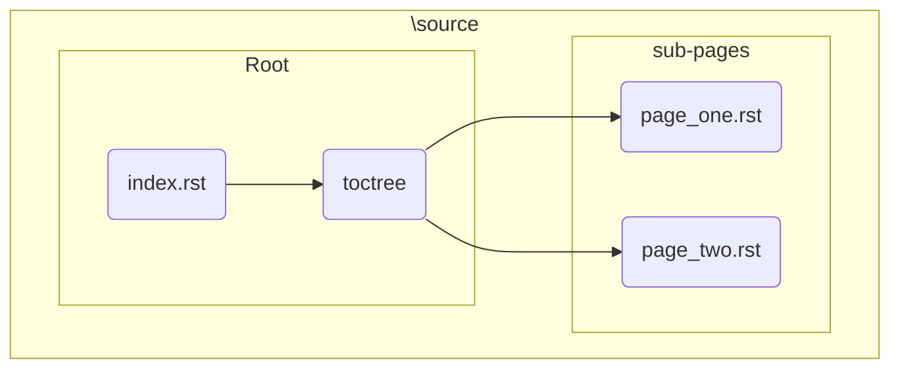
**Building HTML Pages**

Site Source: [Building your HTML documentation](https://www.sphinx-doc.org/en/master/tutorial/first-steps.html)

To create the html pages go into the `/docs` directory and then create `index.html` by typing out `make html`.  

**Python Doctests**

Site Source : [Sphinx customization](https://www.sphinx-doc.org/en/master/tutorial/more-sphinx-customization.html)

You can check if the intended code for used for documentation gives the expected inouts and outputs and is one to one. `doctest` is used for this purpose. In order to do this speciffy the location to `sys.path` in `conf.py` if the directory is not listed in sys.path. Add the `extension='sphinx.ext.doctest'` as an extension in `conf.py`. Then use the standard library interpreter promt to `>>>` with the expected output.
```python
# If extensions (or modules to document with autodoc) are in another directory,
# add these directories to sys.path here.
import pathlib
import sys
sys.path.insert(0, pathlib.Path(__file__).parents[2].resolve().as_posix())
```

doctest block example:
```
>>> import python_file
>>> python_file.get_random_ingredients()
['shells', 'gorgonzola', 'parsley']
```

**Automatic Document Generation**

Site Source: [Documentation](https://www.sphinx-doc.org/en/master/tutorial/describing-code.html)

The `.. autofunction::` and `.. autoexception::` directives creates automated python and function directives. In the python file use a comment block and write notes about the function beneath it use the `:` to explain parameters of the function. Like the exmaple shown down below. Sphinx will arange them in the form of a function automatically. 

```python 
def get_random_ingredients(kind=None):
    """
    Return a list of random ingredients as strings.

    :param kind: Optional "kind" of ingredients.
    :type kind: list[str] or None
    :raise lumache.InvalidKindError: If the kind is invalid.
    :return: The ingredients list.
    :rtype: list[str]

    """
    return ["shells", "gorgonzola", "parsley"]
```

**Automatic Summary Generation**

The `.. autosummary::`directives creates a brief summary of a the utilities of the function. It keeps the code and the documentation in sync but only keeps the necessary information. Write the extension `extension=['sphinx.ext.autosummary',]`. Use the directive `.. autosummary::` and then `:toctree: generated` embedded within it. 

```
API
===

.. autosummary::
   :toctree: generated

   lumache
```

```mermaid 
flowchart 
direction LR

    subgraph <b>Sphinx
        direction LR
        s(Python File) --> a(Doctest) --> d(checks code to document functionality sync)
        s --> b(Auto Function and Exception) --> e(auto generates website presentable code documentation)
        s --> c(Auto Summary) --> f(filtered and summarised code documentation)
        d --> g1(make doctest)
        e --> g(make HTML)
        f --> g
        g --> h(Present)
    end
```
### Project Objective: Sphinx


### JSON 

  * JSON Structure:
    #### Basic JSON example
    <p align="center">
            
    </p>
    <details>


        <summary>click to see the code for the JSON example</summary>

        {
        "Exchanges":{
                "bybit":{
                        "bybit-User One": {
                            "apiKey":"sdfun4e7582h&Hs38hjF^782w",
                            "secret":"wdio238dm&i2",
                            "elective login": {"password":"", "uid":""},
                            "strategies":[{"Name":"RSI Strategy",
                                    "Perp": "Inverse",
                                    "Symbols":["BTCUSD","ETHUSD", "MATICUSD"],
                                    "Description": "RSI strategy parameters 45,55,300 Long on MATIC,BTC,ETH",
                                    "Last Updated Unix": 1655236960,
                                    "Last Updated Date": "2022-06-14 20:02:40"
                                    }],
                            "data endpoints": [{
                                            "Perp": "USDT",
                                            "Symbols": [["BTCUSDT", "1d"], ["BTCUSDT","1h"], ["ETHUSDT","3m"]],
                                            "Default Time Frame'": "1m",
                                            "White List": ["BTCUSDT", "ETHUSDT"],
                            "Black List": [""],
                            "Apply": "wl",
                            "New Pair": "wl",
                                            "Last Updated Unix": 1655235840,
                                            "Last Updated Date": "2022-06-03 05:57:20"
                                            }],
                            "key permissions": "Read/Write",
                            "timeout": 10000,
                            "rateLimit": 2200,
                            "working": true 
                    }            
                }
            }
        }
    </details>


    #### JSON Key Value Types

     <p align="center">
            
    </p>

    **JSON Properties**

    * `<exchange name>`: Exchange name from the supported exchanges, run `ccxt.exchanges` to see all available exchanges. Type : **<span style="color:orange">dict</span>**.
    * `<API Config name>`: The set name for the API key. The user can name the API for identification purposes.  Type : **<span style="color:green">dict</span>**.
    * `apiKey`: API key set-up by the user and configured from the exchange.  Type : **<span style="color:green">string</span>**.
    * `secret` : API secret set-up by the user and configured from the exchange. Type : **<span style="color:green">string</span>**.
    * `elective login`:  Extensive login credentials(password, uid or both), some exchanges might require these params for authentication. Type : **<span style="color:purple">list</span>**.
        * `password`:  password of the API, set-up by the user and configured from the exchange. Type : **<span style="color:green">string</span>**.
        * `uid`: uid of the API, set-up by the user and configured from the exchange. Type : **<span style="color:green">string</span>**.
    * `strategies`: The user sets up the strategies to be listened to by assighning symbols to the exchanges trading pairs. Type : **<span style="color:purple">list</span> of <span style="color:orange">dicts</span>**.
        * `Name`: The name of the strategy. Type : **<span style="color:green">string</span>**.
        * `Perp`: The assighned Perpetual for the strategy.  Type : **<span style="color:green">string</span>**. All the possible perpetuals: 
            * **Inverse**
            * **USDT**
            * **SPOT**
            * **Options**
            * **Inverse Futures**
        * `Symbols`: The trading pair the strategy is assighned to trade on. Type : **<span style="color:green">string</span>**.
        * `Descriptions`: The user can describe the feautures of the trades like the direction of trades. Type : **<span style="color:green">string</span>**.
        * `Last Updated Unix`: The unix time of last updated updated the DBs for the trades. Type : **<span style="color:red">int</span>**.
        * `Last Updated Date`: Readable date of UTC+0 of the time last updated of the DBs for the trades. Type : **<span style="color:green">string</span>**.
    * `data endpoints`: Data endpoints are configured to fetch **OHLCV, OI, Funding Rate etc..** for certain trading pairs split by perpetuals. Type : **<span style="color:purple">list</span> of <span style="color:orange">dicts</span>**.
        * `Time Frame`: The timeframes to collect the data for exmaple for OHLCV it could collect data on the daily or hourly timeframes. Type : **<span style="color:green">string</span>**.
        * `Default Time Frame`: Is the **Time Frame** value that is automatically assigned to **New Pair** values.  If there is a newly added pair to the exchange then the value for the Default Time Frame. Type : **<span style="color:green">string</span>**.
        * `White List`: White List is all the pairs that the user wants to fetch data from. The pairs must be a tradable by the exchange for it to be in this list. Type : **<span style="color:green">string</span>**.
        * `Black List`: Black List is all the pairs the user does not want to collect data from. The pairs must be a tradable by the exchange for it to be in this list. Type : **<span style="color:green">string</span>**.
        * `Apply`: Values of **<span style=color:green>‘wl’ = White List, ‘bl’ = Black List, ‘all’= All Pairs**<span> that the user sets to where ‘wl’ states all the whitelisted trading pairs will be used to fetch data from.
        * `New Pair`: Value that is set by the user to be either **<span style=color:green>‘wl’ = White List, ‘bl’ = Black List, ‘none’= None**</span>. Type : **<span style="color:green">string</span>**.
    * `key permission`: The permission given to the API key. It could be **<span style=color:red>[read, write, read and write]**</span>. Type : **<span style="color:green">string</span>**.
    * `timeout`: A timeout in milliseconds for a request-response roundtrip. If the response is not received in that time, the library will throw an **<span style=color:red>RequestTimeout</span>** exception. Type : **<span style="color:red">int</span>**.
    * `rate Limit`: A request rate limit in milliseconds. Specifies the required minimal delay between two consequent HTTP requests to the same exchange. Type : **<span style="color:red">int</span>**.
    * `working`:  Shows whether the API is functional, is a bool value **<span style=color:blue>True** </span>for if its functional **<span style=color:red>False** </span>if not. Type : **<span style="color:green">string</span>**.

    <p align="center">.

        
    
    </p>

    Example:
        <p align="center">
        
        </p>

#### CCXT 

* `CCXT.py` script will also be used to fetch data from the exchanges. The historical trades and funding rate data will be collected to create the PnL values for the **Inverse** and **USDT** swaps. The historical trades will be fetched to obtain the data for (`Contracts`, `Average Entry`, `Average Exit`, `Closed P&L`, `Exit Type`, `Trade Time UTC+0`) columns. The funding rate will contain data for the following columns (`symbol` , `timestamp` , `datetime` , `id` , `amount`). `CCXT.py` is also a part of [Configurations](../Configurations.md) listed as the [APIs](../Configurations.md#expanding-on-the-components-of-configurations) under the **Expanding on the Components of Configurations**. To understand the use cases for `CCXT.py` and `Matplotlib_Pandas.py` click the hyperlinks of [CCXT](../Configurations/API%20configs/CCXT.md) and [Matplotlib and Pandas](../Configurations/Pandas.md) respectively.


   * Error Handling:

   * State Diagram:
        <details>
        <summary>Click to open State Diagram for CCXT :</summary>
        <p align="center">
        
        </p>
        </details>

    * Dependencies:
#### PnL Values 

* `PnL_vals.py` utility is to create the data frames to be plotted. The data frames will include that of the `PnL %`s and the `Capital Values`, there will be a variety of Dependant(y) and Independent(x) variables for `PnL %`s and `Capital Values` each. 

#### Plotting 

* The plotting of the graphs are done through `Matplotlib_Pandas.py`, it is part of the [Configurations](../Configurations.md). The Plots will include Line and Bar graphs. Subplots will be used to organize the positioning of the graphs.

#### Main Script

* `Realtime_analytics.py` is where all the functionality of Realtime Analytics will run from so it is essentially the main script. It contains a nested for loop with a total of 4 loops and an additional conditional for loop for the inverse perpetual. The loops are used to iterate through the following components in order (`Directions/Trading Modes`, `Swaps`, `Interest Rates`, `(Independent) X-Axis Variables`, `(Conditional if Swap=Inverse)(Dependant) Y-Axis Variable`). The actions under each iteration of the sequences for each for loop is expanded on below:  
    * The first loop (main loop) will go through the `Trading Modes` [Long, Short, Long and Short].  As the `Trading Modes` are being iterated the `PnL %`s are going to be calculated for each of the `Swaps` [Inverse perp, USDT perp]. To calculate the `PnL %`s the module `PnL_vals.py`'s `PnL_percentage()` function will be called. A pandas data frame will be return both the USDT and the Inverse Perpetuals PnLs. The data frame will include the columns [Entry, Exit, USDT PnL, Inverse PnL , index] with the rows of data. The data frame of The PnL %s will be plotted by calling the `Bar_Line_plots()` function from the `Matplotlib_Pandas.py` module. The first row of the plots will have a line and bar plot and the second row will have a cumulative line plot. The dependant variable will be **PnL%**'s and the independent variable will be **Dates** when plotting the three subplots.


    * The second part of the code is calculating and plotting the `Capital`. `Capital` can be broken into two sections regarding `Interest` **[Compounding, Non-Compounding]**.  `Capital` values will be called from the `Capitals()` function from the `CCXT.py` script. The purpose of this part is to see the amount of money/capital the trades would have turned into from the initial investment with the exposure of interest rates. If the strategy were to be used and simulated between the start and ending indexes of the dataset, the amount of capital gain/loss is reproduced. There are three outputs for `Capital`  [Capital Endings, Maximum Gain, Minimum Gain]. The explanation of each part is shown below:
        <details>
        <summary>Capital Components Definitions and Examples</summary>
        
        * `Capital Endings`: The ending capital in percentage between the start and ending date, shown after the end of all trades. The amount of capital gain/loss from a modified starting date to the fixed ending date. <br>
            * <span style="color:green"> Example: </span>  <br> For the array: `[[1.12,1.25,1.18],[1.0,1.12, 1.06],[1.0,1.0,0.94]]` the last values of each row will be the `Capital Ending` values so `[1.18,1.06,0.94]` is produced.</br>
            </br>
        * `Maximum Gain`: The maximum capital gain in percentage between the start and ending date. Maximum realized gain from a modified starting date to the fixed ending date.
            * <span style="color:green"> Example:  </span>  <br> For the array: `[[1.12,1.25,1.18],[1.0,1.12, 1.06],[1.0,1.0,0.94]]` the maximum values of each row will be the `Maximum Gain` values so `[1.25,1.12,1.0]` is produced.</br>
            <br>
        * `Minimum Loss`:  The maximum capital loss in percentage between the start and ending date. Maximum realized loss from a modified starting date to the fixed ending date.
            * <span style="color:green"> Example:  </span>  <br> For the array: `[[1.12,1.25,1.18],[1.0,1.12, 1.06],[1.0,1.0,0.94]]` the minimum values of each row will be the `Maximum Loss` values so `[1.12,1.0,0.94]` is produced.</br>
            </br>

            `Capital` values will be a `n x n` matrix for each `Interest` rates **[Compounding, NonCompounding]**. The rows in the matrix represents different starting intervals for the strategy, as the rows are descending the start and ending indexes are sliced by one from the top. Each value represents the capital value change. So by slicing we can see how the capital could have changed from any possible starting interval between. Shows all the possible outcomes. 

        </details>


    * The conditional for loop is only if the swap iterated is `Inverse Perpetual`. Since the quote of the `Inverse Perpetual` is the asset the Y-Axis-Variable(Dependant) could be graphed in terms of [Price in USD or Number of Shares/Tokens]. 


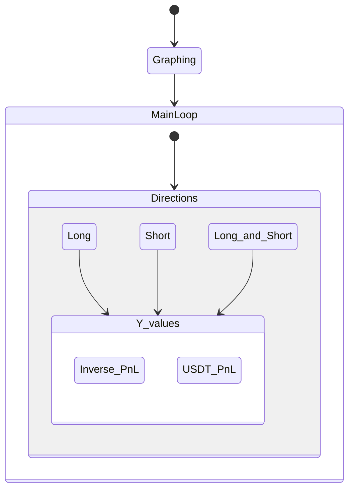

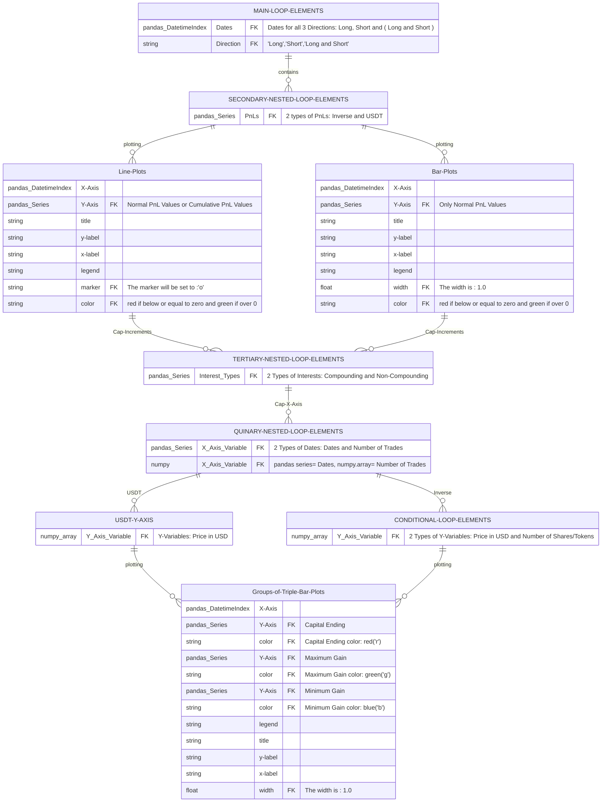
